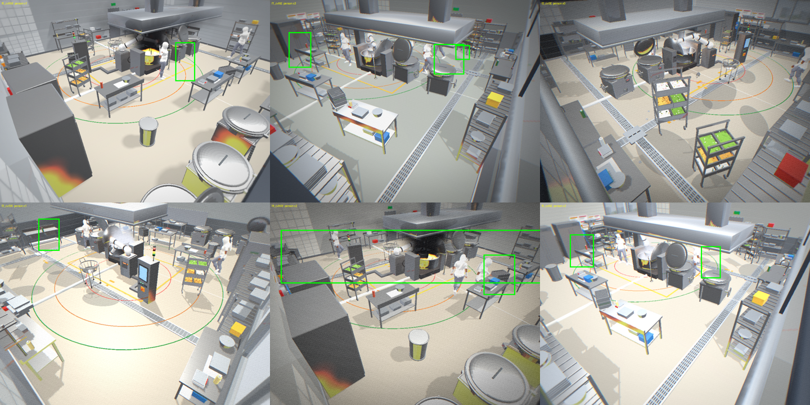
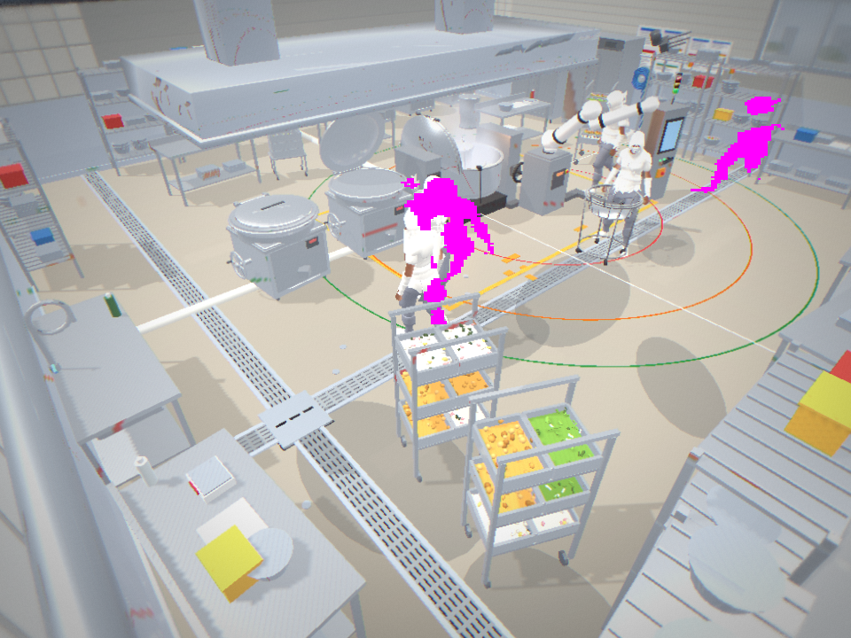
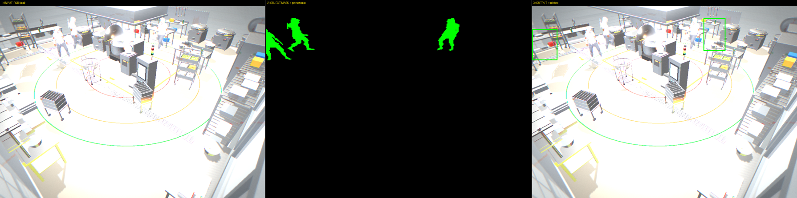
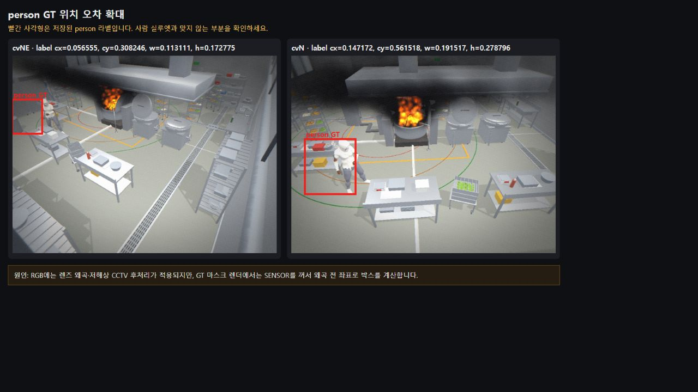
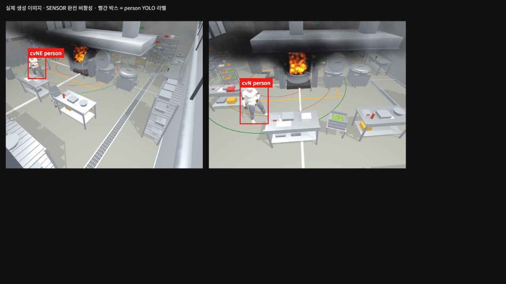

# PR #25–#28 사선 CCTV person 라벨·데이터·지표 전체 보고서 (2026-08-26)

> 이 문서는 이번 세션에서 수행한 코드 검토, 실제 Chrome 캡처, 라벨 오류 분석, 수정,
> 데이터셋 감사, 학습 지표, 실패한 접근과 PR 역할 분담을 한곳에 정리한 기준 문서다.
> 특히 **validation(검증)과 test(최종 평가)를 구분**하고, 현재 파일로 다시 확인할 수 없는
> 과거 수치는 확정 결과가 아니라 **세션 기록**으로 표시한다.

## 1. 결론

- person 라벨의 화면 전체 부풀림과 팬텀 박스의 근본원인은 **거리 제한 없는 최근접색 분류**였다.
  person 인스턴스만 `±26` 정확색 분류와 연결성분 분석으로 처리해 해결했다.
- 라벨이 사람과 평행하게 어긋난 두 번째 문제는 연기나 마스크가 아니라 **RGB와 GT 마스크가
  서로 다른 센서 후처리 경로를 사용한 것**이 원인이었다. PR #28의 원본 학습 캡처에서만 센서를
  완전히 끄고 RGB와 GT의 픽셀 좌표계를 맞췄다.
- 보정 합성 원본은 **660장 = 110장면 × 6카메라**다. 실제 학습 분할은 장면 단위로
  **train 564장(94장면), val 96장(16장면), 독립 test 0장**이다. 따라서 이 실험의 수치는
  held-out validation(학습에서 제외한 검증 세트)이지 최종 test 성능이 아니다.
- 보존된 6클래스 validation 결과는 YOLO11n@960에서 recall `0.7215`, YOLO11s@1280에서
  recall `0.7705`다. person만 따로 계산한 세션 기록은 각각 `0.344`, `0.409`이나 클래스별
  평가 출력 파일이 보존되지 않아 같은 근거 수준으로 취급하면 안 된다.
- Chef1 실사 데이터는 train `3,767`, valid `1,074`, test `546`장으로 모두 보존돼 있다.
  하지만 기존 문서의 Chef1 test recall `0.970/0.048/0.961`은 원본 평가 출력이 남아 있지 않다.
  이번 보고서에는 현재 `results.csv`로 확인 가능한 **valid person 지표**와 데이터 장수만 확정값으로 쓴다.
- PR #25는 라벨·재현 가능한 원본 생성, PR #26은 BEV 융합·전역 ID·예측, PR #27은
  person-only 계약 시도, PR #28은 이번 세션 보고서와 원본 캡처의 RGB–GT 정렬 수정이다.

## 2. 목표와 범위

최종 목표는 사선 조리실 CCTV에서 사람을 검출하고, 카메라별 추적 ID를 BEV(위에서 내려다본
공통 평면) 좌표로 합친 뒤 궤적과 위험을 예측하는 것이다. 이번 세션의 직접 범위는 그 앞단인
**사람 GT 라벨이 실제 사람을 정확히 감싸는지**, 그 라벨로 만든 데이터와 지표를 믿을 수 있는지,
PR #25·#26·#27의 역할이 겹치는지를 확인하는 것이었다.

이번 문서의 결과만으로 다음을 주장하지 않는다.

- 실주방에서의 안전 성능
- 여러 카메라의 동일 인물을 하나의 전역 ID로 정확히 합친 비율
- ByteTrack의 시간축 ID 유지율
- 보정 합성 데이터의 독립 test 일반화 성능

## 3. 핵심 검증 이미지 5종

아래 다섯 이미지는 `docs/chanwoo/handoff/img/`에 PR 자산으로 보존했다.

| 순서 | 파일 | 확인한 내용 |
|---:|---|---|
| 1 | `01-before-label-errors.png` | 수정 전 person 박스의 부풀림·미라벨·오프셋 |
| 2 | `04-inflation-rootcause.png` | 한 person 인스턴스 색으로 분류된 원거리 오염 픽셀 |
| 3 | `03-objmask-io.png` | RGB → person 객체 마스크 → YOLO 박스 생성 과정 |
| 4 | `07-rgb-gt-offset.png` | 센서 후처리가 켜진 RGB와 GT 좌표의 어긋남 |
| 5 | `08-sensor-off-aligned.png` | 원본 캡처 센서 완전 비활성화 후 최종 정렬 |

### 3.1 수정 전 라벨 오류



초록 박스가 person GT다. 사람 한 명의 박스가 화면 가로를 크게 가로지르거나, 보이는 사람에게
박스가 없거나, 박스가 사람 왼쪽 설비 쪽으로 벗어난 사례를 직접 확인했다. 처음 사용한 중심점 거리
지표는 큰 박스의 중심이 사람 근처에 있으면 통과해 오류를 놓쳤다.

### 3.2 부풀림 근본원인



마젠타는 한 person 인스턴스 색으로 분류된 픽셀이다. 실제 사람 외에 오른쪽 먼 영역도 같은 색으로
분류됐다. 이 덩어리들을 하나의 박스로 합치면서 화면을 가로지르는 잘못된 박스가 생겼다.

### 3.3 최종 라벨링 입력과 출력



가운데의 녹색 픽셀만 person 인스턴스 마스크다. 설비·카트·화재 픽셀은 검정 배경으로 제외되고,
오른쪽 출력에서는 이 person 픽셀 범위로만 박스를 만든다.

### 3.4 RGB–GT 좌표 어긋남



박스 개수만 확인하면 정상처럼 보이지만 확대하면 `cvNE`, `cvN` 모두 빨간 박스가 사람보다 왼쪽에
있다. RGB는 센서 후처리를 거쳤고 GT 마스크는 후처리를 제거한 상태여서 서로 다른 픽셀 좌표계를
사용한 것이 원인이었다.

### 3.5 최종 RGB–GT 정렬



일반 시뮬레이터의 화면 효과는 유지하고, 학습 원본 생성기에서만 센서를 완전히 비활성화했다.
최종 960×720 생성 이미지에서 `cvNE`와 `cvN`의 person 박스가 사람 실루엣을 감싸는 것을 확인했다.

보조 이미지로 수정 후 12프레임 몽타주(`02-after-fixed.png`), 정확색·거리 제한 비교
(`05-exactcolor-nomaxgap.png`), seed `424242`의 6카메라 전수 확인
(`06-person-6cam-audit.png`)도 같은 폴더에 남겼다.

## 4. 라벨 오류의 근본원인과 해결

### 4.1 문제 1: person 박스 부풀림·팬텀·미라벨

수정 전 `classifyByNearest`는 각 픽셀을 가장 가까운 팔레트 색에 무조건 배정했다. 색상 거리가
아무리 멀어도 가장 가까운 색 하나는 존재하므로 화재, 연기, 설비의 혼합 픽셀도 person 색으로
들어갈 수 있었다. 이후 연결성분의 전체 범위를 합치면서 멀리 떨어진 잘못된 픽셀까지 person 박스에
포함됐다.

최종 person 라벨 경로는 다음과 같다.

1. person, robot, kettle의 기본 인스턴스 색을 equipment보다 먼저 예약한다.
2. `classifyExact(..., tolerance=26)`로 person 팔레트의 RGB 각 채널에서 `±26` 안에 드는 픽셀만
   해당 인스턴스로 인정한다. 어느 색에도 들지 않으면 배경 `-1`로 버린다.
3. 연결성분 분석으로 작고 고립된 잡티를 제거한다. 기본값은 `minComp=30`, `minPixels=80`이다.
4. person은 `relativeMin: 0`으로 확인된 팔·다리의 작은 조각을 보존한다.
5. person에는 `maxGap`을 쓰지 않는다. 큰 설비에 가려 실제 신체가 멀리 나뉜 경우를 버리지 않기
   위해서다.

fire, smoke, robot, kettle, equipment는 기존 최근접색 경로와 기본 상대 성분 필터 `0.15`를
유지한다. 즉 시뮬레이터 전체를 person-only로 바꾼 것이 아니라 **person 라벨 생성만 별도 안전
경로로 분리**했다.

### 4.2 문제 2: 라벨이 사람과 평행하게 어긋남

첫 시도에서는 왜곡, 색수차, 블러만 0으로 만들었다. manifest 설정 테스트는 통과했지만 실제 이미지를
겹쳐 보니 어긋남이 남았다. 일부 값이 0이라는 사실은 두 렌더 경로의 좌표가 같다는 증명이 아니었다.

확정된 원인은 다음과 같다.

- RGB 패스: Babylon 렌즈·센서 후처리 파이프라인 사용
- GT 마스크 패스: `gtOff()`가 센서를 끄고 후처리 파이프라인 제거

PR #28의 `tools/headless_gen/gen.cjs`는 원본 학습 캡처에서만 아래 값을 고정한다.

```text
enabled=false
grain=0, distortion=0, chroma=0, blur=0
vignette=0, exposureJitter=0, lowResolution=0
```

향후 센서 열화가 필요하면 RGB에만 실시간 적용하지 않고, 이미지와 박스를 같은 기하 변환으로 함께
바꾸는 오프라인 증강으로 적용해야 한다.

## 5. 데이터셋 전체 감사

### 5.1 보정 합성 6카메라 데이터

원본 `sim-fixed-6cam`은 110개 장면을 6개 카메라(`cvN`, `cvNE`, `cvNW`, `cvS`, `cvSE`,
`cvSW`)에서 캡처한 660장이다. 클래스 계약은 다음과 같다.

| class id | 이름 |
|---:|---|
| 0 | person |
| 1 | fire |
| 2 | smoke |
| 3 | robot |
| 4 | kettle |
| 5 | equipment |

원본 폴더의 편의용 `data.yaml`은 train/val/test가 모두 같은 `images` 폴더를 가리키므로 성능 평가에
사용하면 안 된다. 실제 학습에는 `_simfixed_split`의 장면 단위 목록을 사용했다. 같은 장면의 6개
카메라는 항상 같은 분할에 있어 장면 누출이 없다.

| 분할 | 장면 | 이미지 | 카메라별 이미지 | person 포함 이미지 | 전체 박스 | person | fire | smoke | robot | kettle | equipment |
|---|---:|---:|---:|---:|---:|---:|---:|---:|---:|---:|---:|
| train | 94 | 564 | 94 | 446 | 10,735 | 730 | 252 | 252 | 449 | 1,161 | 7,891 |
| val | 16 | 96 | 16 | 89 | 1,961 | 154 | 42 | 42 | 83 | 213 | 1,427 |
| test | 0 | 0 | 0 | 0 | 0 | 0 | 0 | 0 | 0 | 0 | 0 |
| 합계 | 110 | 660 | 110 | 535 | 12,696 | 884 | 294 | 294 | 532 | 1,374 | 9,318 |

train은 장면 1–109 중 7의 배수가 아닌 94개, val은 장면 `0, 7, 14, ..., 105`의 16개다.
**독립 test가 없으므로 아래 simfixed 지표는 val 지표다.**

### 5.2 Chef1 실사 person 데이터

`chef1_v5` 원본은 `clothes`, `correct mask`, `hat`, `human` 네 클래스를 가진다. 이번 3-way
검출 비교에서는 원본 class 3 `human` 박스만 골라 6클래스 계약의 class 0 `person`으로
변환했다. 결과 라벨에는 class 0만 존재하며, 원본의 clothes·mask·hat 박스는 사용하지 않는다.

| 분할 | 이미지 | 라벨 파일 | person 박스 | 빈 라벨 이미지 |
|---|---:|---:|---:|---:|
| train | 3,767 | 3,767 | 7,354 | 703 |
| valid | 1,074 | 1,074 | 2,184 | 194 |
| test | 546 | 546 | 1,058 | 92 |
| 합계 | 5,387 | 5,387 | 10,596 | 989 |

빈 라벨 이미지는 파일 누락이 아니라 person 객체가 없는 hard negative(사람이 없는 배경 표본)다.

### 5.3 Chef1 3-way 학습 구성

| 조건 | 학습 이미지 | 구성 | 평가용 valid | 평가용 test |
|---|---:|---|---:|---:|
| A real-only | 3,767 | Chef1 train | Chef1 1,074 | Chef1 546 |
| B sim-only | 270 | `sim-oblique-6cam-merged` | Chef1 1,074 | Chef1 546 |
| C real+sim | 4,037 | Chef1 3,767 + sim 270 | Chef1 1,074 | Chef1 546 |

3-way에 사용된 sim 270장은 6클래스 라벨이며 전체 박스 5,494개다. 클래스별로 person 396,
fire 144, smoke 144, robot 210, kettle 544, equipment 4,056개다. 평가 스크립트는
`classes=[0]`으로 person만 측정한다.

### 5.4 PR #26 예비 detector gate

PR #26의 4+1뷰 동기화 gate는 별도 소규모 데이터다.

| 항목 | 수량 |
|---|---:|
| 장면 | 10 |
| 카메라 뷰 | 장면당 5 |
| 이미지 | 50 |
| person GT 박스 | 35 |
| 판정 IoU | 0.5 |

장면 seed가 보존되지 않아 정식 benchmark가 아니라 go/no-go 진단이다. 보정 660장 데이터나
Chef1 test와 합쳐서 해석하면 안 된다.

## 6. 지표

### 6.1 현재 결과 파일로 재확인한 simfixed 6클래스 val

두 실행 모두 YOLO11, 60 epochs, seed 0, deterministic 설정이며 같은 train 564/val 96 분할을
사용했다. 아래는 `training/*/results.csv` 마지막 행의 **6클래스 전체 평균**이다.

| 모델 | 입력 크기 | precision | recall | mAP50 | mAP50-95 |
|---|---:|---:|---:|---:|---:|
| YOLO11n | 960 | 0.8059 | 0.7215 | 0.7685 | 0.5307 |
| YOLO11s | 1280 | 0.8143 | 0.7705 | 0.8085 | 0.5040 |

person 클래스만 따로 계산한 당시 세션 기록은 다음과 같다.

| 모델 | precision | recall | mAP50 | 근거 수준 |
|---|---:|---:|---:|---|
| YOLO11n@960 | 0.513 | 0.344 | 0.356 | 클래스별 출력 미보존, 세션 기록 |
| YOLO11s@1280 | 0.518 | 0.409 | 0.433 | 클래스별 출력 미보존, 세션 기록 |

전체 recall과 person recall이 다른 이유는 equipment 등 쉬운 클래스가 6클래스 평균을 끌어올리기
때문이다. `0.7705`를 person recall로 말하면 안 된다.

### 6.2 현재 결과 파일로 재확인한 Chef1 valid person 지표

아래는 `training/chef1_*/results.csv` 마지막 행에 남은 valid person 지표다. valid 라벨에는
class 0 person만 있으므로 다른 다섯 클래스와 평균된 값이 아니다.

| 학습 조건 | precision | recall | mAP50 | mAP50-95 |
|---|---:|---:|---:|---:|
| A real-only | 0.9385 | 0.9565 | 0.9652 | 0.6144 |
| B sim-only | 0.0069 | 0.0261 | 0.0009 | 0.0001 |
| C real+sim | 0.9439 | 0.9483 | 0.9655 | 0.6143 |

이 표는 Chef1 **valid 1,074장**의 결과다. 학습 스크립트는 test 546장도 평가하도록 작성됐지만
그 콘솔 출력 또는 별도 결과 파일은 보존되지 않았다. 기존 문서의 test recall
`real-only 0.970 / sim-only 0.048 / real+sim 0.961`은 재평가 전까지 확정 수치로 사용하지 않는다.

### 6.3 PR #26 detector gate

| 모델 | confidence | precision | recall |
|---|---:|---:|---:|
| 기존 나디르 fine-tune | 0.25 | 0.000 | 0.000 |
| stock YOLO11s | 0.25 | 0.174 | 0.114 |

이 낮은 recall은 PR #25 또는 #27 하나만의 결과가 아니다. 새 4+1뷰에 맞춰 학습되지 않은 검출기,
작고 사선인 사람 외형, threshold와 데이터 조건이 함께 영향을 준다. PR #25는 새 학습 라벨의 오류를
제거하지만 stock YOLO의 낮은 값까지 직접 설명하지 않는다. PR #27의 person-only 계약도 검출기가
작은 사람을 더 잘 보게 만들지는 않는다.

### 6.4 어느-카메라든 검출 비율 0.938의 취급

같은 날 별도 로컬 실행에서 14장면·person 32명 중 30명이 6개 카메라 가운데 적어도 한 곳에서
검출돼 `30/32 = 0.938`이 기록됐다. 그러나 해당 실행의 정확한 입력 목록, 가중치 hash, 출력 파일이
현재 보존되지 않았고 현재 `_fusion` 폴더는 **12장면·person 29명**으로 다른 데이터다.

따라서 `0.938`은 다음처럼 제한해서 해석한다.

- 세션 당시의 예비 **어느-카메라든 검출 비율**
- BEV 전역 ID 융합 recall이 아님
- ByteTrack의 시간축 recall이 아님
- false positive를 포함한 종합 성능이 아님
- 현재 `_fusion` 데이터로 재현됐다고 말할 수 없음

## 7. 트러블슈팅 기록

| 증상 | 확인한 원인 또는 판정 | 최종 처리 |
|---|---|---|
| person 박스가 화면 전체로 부풀음 | 최근접색에 거리 상한이 없어 화재·연기·설비 픽셀을 person으로 분류 | person만 정확색 `±26` + 연결성분 필터 |
| 보이는 사람 미라벨·팬텀 박스 | person 팔레트와 equipment 색 충돌, 잘못된 픽셀 배정 | person·robot·kettle 기본색을 equipment보다 먼저 예약 |
| 중심점 자동 검사가 팬텀 0으로 오보 | 부풀린 박스 중심이 사람 근처면 통과 | 몽타주·원본 확대 등 시각 검사 병행 |
| 3D 투영 gate가 보이는 사람을 버림 | 장면 변경 후 스킨드 메시 world bbox가 오래된 상태 | 투영 gate 폐기, 정확색 경로 유지 |
| 정확색 뒤 조각 보존 정책이 애매함 | 거리 제한이 가림으로 떨어진 실제 팔·다리를 버릴 수 있음 | person은 `relativeMin:0`, `maxGap` 미사용 |
| RGB 박스가 사람 왼쪽으로 어긋남 | RGB는 센서 후처리 사용, GT는 센서 제거 | 원본 생성에서만 SENSOR 전체 비활성화 |
| 왜곡·색수차·블러만 0인데 어긋남 지속 | 일부 값 0은 전체 파이프라인 동일성을 보장하지 않음 | 실제 PNG 겹침 검사 후 `enabled=false`까지 적용 |
| 데이터 생성 중 서버 정지 | 단일 스레드 서버가 렌더 중 GLB 요청을 동시에 처리하지 못함 | 생성기가 전용 멀티스레드 서버를 직접 실행 |
| 두 번째 이후 캡처가 단색 | 후처리 체인 준비 전에 다음 RGB 캡처 | `whenReadyAsync()` 준비 대기 유지 |
| 반복 생성 중 프롭 오류 | 기준 장면에 없는 프롭을 즉시 등록 | 없는 프롭만 지연 등록 |
| 장면 중간 실패 후 일부 파일만 남음 | 이미지·라벨·manifest 공개가 원자적이지 않음 | 장면 임시 폴더, transaction, rollback |
| 기존 출력 덮어쓰기 위험 | 시작 시 manifest를 새로 쓸 수 있음 | 출력 폴더가 비어 있지 않으면 실행 거부 |
| seed가 같은데 비동기 로드 순서 영향 | 장면 RNG와 프롭 RNG가 같은 흐름 공유 | RNG 분리, 입력·런타임·결과 hash를 manifest에 기록 |
| 기존 Chrome을 건드릴 위험 | 다른 작업이 데이터 생성에 사용 중 | 전용 임시 프로필의 새 Chrome만 화면 밖에서 실행 |
| bare `python` 학습 실패 | PyTorch가 해당 Python에 없음 | ultralytics·CUDA가 설치된 `.venv` 사용 |

## 8. PR별 역할 분담과 진행 순서

| PR | 담당 역할 | 현재 결론 |
|---|---|---|
| #25 | person 정확색 라벨, 팔레트 분리, 분할 전 6카메라 원본 생성, manifest·hash·실패 복구 | 라벨·생성기 기반으로 필요 |
| #26 | 4+1 카메라 스케줄링, BEV 통합, 전역 ID, K=3 예측 | person detector gate 통과 후 재검증 |
| #27 | 시뮬레이터 전체를 person-only 계약으로 축소 | 현재 형태는 불필요; 후처리 split·class 0 필터만 작은 도구로 대체 |
| #28 | 이번 세션 전체 보고서, 검증 이미지, 원본 RGB–GT 센서 정렬 | #25와 분리해 검토·병합 |

권장 순서는 다음과 같다.

1. PR #25 라벨·원본 생성 기반 확정
2. PR #25 원본 manifest를 입력으로 장면 단위 train/val/test 분리
3. 학습 입력에서만 class 0 person을 추출
4. 독립 test를 새로 잠그고 person precision·recall 측정
5. detector gate를 정한 뒤 PR #26의 detector→카메라별 추적→BEV 전역 ID→예측을 끝까지 평가

## 9. 재현법

### 9.1 원본 6카메라 생성

기존 Chrome은 사용하거나 종료하지 않는다. Playwright가 매 실행마다 전용 임시 프로필과 화면 밖의
새 Chrome을 사용한다.

```powershell
cd .\tools\headless_gen
npm ci

# Chrome 기본 설치 위치가 다를 때만 지정
$env:CHROME_PATH = 'C:\Program Files\Google\Chrome\Application\chrome.exe'

# 출력 폴더는 없거나 완전히 비어 있어야 함
node .\gen.cjs 'C:\dataset\sim-oblique-6cam-raw' 20 20260826
```

출력은 `scenes/<scene>/images`, `scenes/<scene>/labels`, `manifest.json`이다. manifest의
`split`은 `null`이며 후속 단계에서 장면 단위로 나눠야 한다.

### 9.2 라벨·생성기 회귀 테스트

```powershell
node --test `
  tests/browser/instance-box-filter.test.mjs `
  tests/browser/person-box-region.test.mjs `
  tests/browser/headless-generator.test.mjs

node --test tests/browser/headless-generator.integration.test.mjs
```

실제 Chrome 통합 테스트도 전용 임시 프로필을 사용한다. 최종 확인 당시 단위 테스트는 `29/29`,
실제 Chrome 통합 테스트는 `2/2` 통과했다.

### 9.3 분할과 지표 재확인 시 주의

- `sim-fixed-6cam/data.yaml`처럼 train/val/test가 같은 폴더인 설정으로 지표를 내지 않는다.
- 같은 장면의 6개 카메라를 서로 다른 분할에 넣지 않는다.
- simfixed에는 현재 독립 test가 없으므로 val 수치를 test라고 부르지 않는다.
- Chef1 valid 1,074장과 test 546장을 구분한다.
- person만 평가할 때 `classes=[0]`을 명시한다.
- 데이터 목록, seed, 모델 가중치 hash, confidence, IoU를 결과와 함께 보존한다.

## 10. 최종 한계와 다음 검증

- 합성 person은 회색·무질감·작은 사선 외형이라 단일카메라 person recall이 낮다. 라벨 수정은
  잘못된 학습을 막는 전제이지 외형 차이를 자동으로 해결하지 않는다.
- 보정 660장에는 독립 test가 없다. 새 장면을 추가해 잠긴 test를 만들어야 한다.
- Chef1은 실제 주방 사람 검출의 더 적절한 근거지만, 현재 보존된 CSV는 valid 결과다. 남아 있는
  `best.pt`로 test 546장을 다시 평가하고 원본 출력과 hash를 커밋해야 한다.
- `0.938`은 입력이 보존되지 않은 작은 예비 표본이다. 새 고정 장면 세트에서 단일캠 검출,
  어느-카메라든 검출, 전역 ID 정확도, 시간축 ID 유지율을 각각 분리해 측정해야 한다.
- 실사 검출 성능, sim 궤적 검증, 실배포 안전 주장은 서로 분리한다.

## 11. 관련 문서와 코드

- PR 처리·코드리뷰 경위: [`2026-08-26-pr25-27-session-report.md`](2026-08-26-pr25-27-session-report.md)
- 상세 기술 경위: [`2026-08-26-oblique-label-fix-and-sim2real.md`](2026-08-26-oblique-label-fix-and-sim2real.md)
- 원본 생성기 사용법: [`tools/headless_gen/README.md`](../../../tools/headless_gen/README.md)
- 라벨 로직: [`gtboxes.js`](../../../gtboxes.js)
- 회귀 테스트: [`tests/browser/`](../../../tests/browser/)

> 보안 참고: Chef1 다운로드 과정에서 사용한 Roboflow API 키가 대화에 노출됐다면 해당 키는
> 폐기하고 재발급해야 한다.
