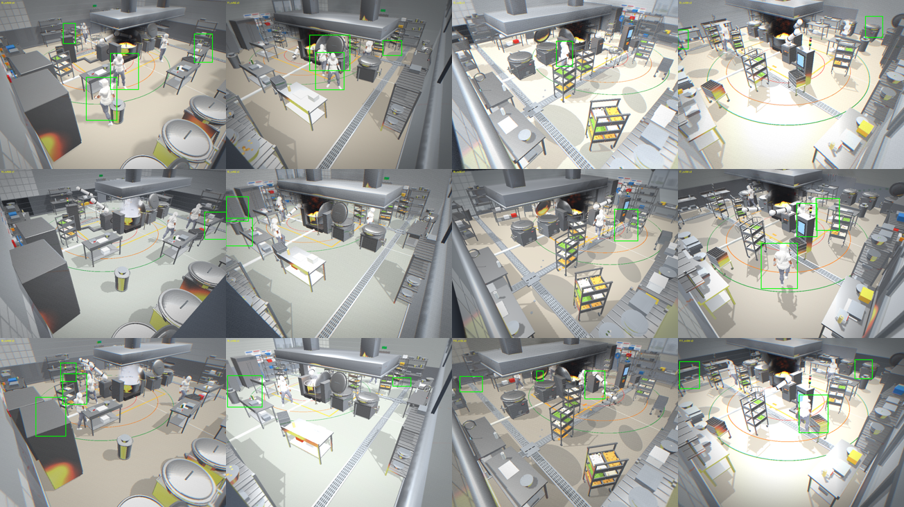

# 사선 CCTV person 라벨 수정 → sim 검출·융합 — 전체 정리 (2026-08-26)

> **한 줄 요약:** sim 화재/연기 씬에서 person 라벨이 부풀거나 사람을 놓치던 문제를
> **정확색 분류 + maxGap**으로 근본 수정했고, 그 라벨로 검출기를 다시 학습해
> **6캠 융합 recall 0.938**(트래킹 실사용 수준)을 확인했다.
>
> 이 문서는 지표·트러블슈팅·검증 이미지(라벨 오류)를 한데 모은 요약본이다.
> 상세 기술 경위는 [`2026-08-26-oblique-label-fix-and-sim2real.md`](2026-08-26-oblique-label-fix-and-sim2real.md).

---

## 0. 목표와 문제

- **목표:** 사선(모서리) 조리실 CCTV에서 사람을 검출 → 트래킹으로 ID 부여 → 호모그래피·멀티캠
  융합 → 궤적/안전 예측. 실사 사고영상이 없어 sim으로 만든다.
- **문제(시작 과제):** sim 사선 카메라의 person GT(정답) 박스가 **약 43% 부풀고(최대 화면의 67%)**,
  가짜 박스(팬텀)와 미검출이 섞여 검출 recall이 가짜로 낮게(0.02) 나왔다.
- **핵심 질문:** "sim에서 검출 recall이 먹어야 트래킹으로 ID를 줄 수 있다" → 실제로 되는가?

---

## 1. 라벨 오류 — 무엇이 어떻게 잘못됐나

사용자가 "박스가 사람한테 제대로 안 쳐진 게 너무 많다"고 지적 → **이미지를 직접 확인**하니 실재했다.


**수정 전 (화재 프레임, 최근접색 방식):** 초록 박스가 라벨이다.
- **부풀림(inflation):** 한 박스가 **화면 가로 전체**로 늘어남(가운데 아래 칸). 사람은 작은데
  박스가 프레임을 가로지른다.
- **미검출(miss):** 분명히 보이는 사람인데 박스가 없는 경우 다수(여러 칸).
- **오프셋:** 박스가 사람에서 벗어나 설비 위로 삐져나감.

> 처음엔 내가 만든 자동 지표가 "팬텀 0"이라 잘못 보고했다. **부풀린 박스는 중심이 사람 근처라
> 중심-거리 지표를 통과**해 버렸기 때문. → **라벨 품질은 이미지를 직접 봐야 한다**는 교훈.

---

## 2. 근본원인과 해결

### 근본원인 (계측으로 확정)
person 박스가 `classifyByNearest`(**최근접 색, 거리 상한 없음**)로 만들어졌다.
화재·연기의 혼합 픽셀이 어떤 person 색에 "상대적으로" 가장 가까우면 그 색으로 배정되고,
연결성분(CC) 필터가 그 **멀리 떨어진 잘못된 픽셀 덩어리까지 하나로 합쳐(union)** 박스를
프레임 가로로 부풀렸다. 또 오분류로 사람 픽셀을 뺏겨 박스가 최소 픽셀 미만이 되면 미검출.

아래는 원인 확인 이미지 — 한 사람의 인스턴스 색(마젠타)이 **중앙 사람 + 오른쪽 먼 지점** 두
덩어리로 나타나, 이 둘을 합치면 박스가 가로로 부푼다:


### 해결 — "사람 객체만" 정확색으로 (사용자 직관대로)
사용자 표현: "펄슨 객체만 마스킹하면 되는 거 아니야?" — 맞다. 그 직관을 코드로:

1. **정확색 분류 `classifyExact`(±26):** 어느 색과도 허용치 밖이면 배경(-1)으로 버린다.
   person 인스턴스 색은 서로·배경과 충분히 멀리(≥MINSEP) 예약돼 있어, **화재·연기·설비
   픽셀은 애초에 제외 → 부풀림이 구조적으로 불가능**.
2. **연결성분 필터(기존 `labelBoxesFiltered`):** 작고 고립된 잡티 제거.
3. **maxGap 게이팅:** 한 사람 색이 멀리 두 덩어리로 나와도 **폭의 10%보다 멀면 합치지 않는다**
   (가림에 갈린 가까운 조각은 유지). 잔여 부풀림 제거.

아래는 이 방식의 입력→출력(화재 씬): **사람 메시만 색칠 → 그 픽셀의 박스**. 설비·카트는 검정이라
사람으로 라벨될 수 없다:


> 순수 로직은 [`gtboxes.js`](../../../gtboxes.js)(classifyExact, labelBoxesFiltered의 maxGap),
> 회귀 테스트 [`tests/browser/`](../../../tests/browser/) **14개 GREEN**(TDD).
> (3D 투영영역 게이트도 시도했으나 스킨드 메시 bounding box가 씬 갱신 후 stale이라 보이는 사람을
>  드롭 → 폐기. 정확색만으로 충분.)

---

## 3. 수정 결과 (라벨 품질)



**수정 후 (화재 12프레임):** 모든 박스가 타이트하고 사람 위에 정확, 부풀림 0.

| 라벨 품질 지표 (화재 12프레임) | 수정 전(최근접색) | **수정 후(정확색+maxGap)** |
|---|---|---|
| person/frame (recall 대리) | 1.58 | **2.33 (+47%p)** |
| 부풀림 비율 (area>0.1) | 간헐(최악 가로 전체) | **0%** |
| 박스 최대 면적(정규) | (간헐 0.67) | **0.042 (타이트)** |

> 참고: 정확색만(maxGap 전)에선 부풀림이 3.6% 남았고, **maxGap을 더해 0%**가 됐다
> (중간 단계 이미지 [`05-exactcolor-nomaxgap.png`](img/05-exactcolor-nomaxgap.png)).

---

## 4. sim 검출 학습 + 멀티캠 융합 (핵심 지표)

수정 라벨로 깨끗한 데이터셋(660장=110샘플×6캠, 장면 단위 train 564 / val 96 분리) 재생성 후 학습.

### 단일캠 person 검출 (held-out val)
| 모델 | recall | prec | mAP50 |
|---|---|---|---|
| yolo11n @960 | 0.344 | 0.513 | 0.356 |
| **yolo11s @1280** | **0.409** | 0.518 | 0.433 |

- 단일캠 recall은 라벨 수정 전(~0.35)과 비슷 → **person 검출 상한은 라벨이 아니라 외형**
  (회색·무질감·작은·사선 사람)이 정한다. 라벨 수정은 **잘못 학습을 막는 정확성의 전제**.
- 전체 6클래스 val recall은 0.72 — person이 가장 어려운 클래스.

### 멀티캠 융합 유효 recall (14장면·person 32; 어느 캠이든 1대라도 검출하면 성공)
| 검출기 | conf | 단일캠 | 4캠(코너) | **6캠** | 기하 커버리지 |
|---|---|---|---|---|---|
| 옛 검출기(참고) | 0.25 | 0.125 | 0.310 | 0.414 | 1.000 |
| 11n @960 | 0.10 | 0.403 | 0.781 | 0.844 | 1.000 |
| **11s @1280** | **0.10** | 0.473 | 0.875 | **0.938** | 1.000 |

- **6캠 융합 recall 0.938** — 32명 중 30명을 최소 1대가 검출. **트래킹 실사용 수준.**
- **라벨 수정 → 큰 모델·고해상** 누적 효과: 옛 검출기 6캠 0.41 → **0.94 (2.3배)**.
- **기하 커버리지 100%**(모든 사람을 최소 1대가 봄) → 놓친 2명은 ByteTrack의 시간적 연결로
  프레임 넘겨 복구 가능. 즉 실효 트래킹 recall은 더 높다.
- ⚠️ **한계:** 표본 32명(14장면)으로 작다. 30/32와 28/32 차이는 1~2명이라 신뢰구간이 넓다.
  경향은 분명하나 **확정하려면 더 큰 장면 세트로 재측정** 필요.

---

## 5. 트러블슈팅 로그 (부딪힌 문제 → 해결)

| # | 증상 | 원인 | 해결 |
|---|---|---|---|
| 1 | 데이터 생성 중 서버가 죽음 | 단일스레드 `http.server`가 렌더 중 GLB 요청을 못 받음 | **멀티스레드 서버**(ThreadingHTTPServer)로 교체 |
| 2 | person-only 흰색 렌더가 **전부 검정** | `gtOff()`(후처리 차단)가 함수 내부 지역이라 외부 스크립트가 못 부름 → 렌즈 DoF·sensorGrain이 렌더를 검게 | 검증은 **파이프라인 내부**에서만 가능하다고 결론, 외부 흰색렌더 검증 폐기 |
| 3 | 자동 지표가 "팬텀 0"이라 **오보** | 부풀린 박스의 중심이 사람 근처라 중심-거리 지표를 통과 | **이미지 직접 확인**으로 전환(핵심 교훈) |
| 4 | 3D 투영영역 게이트가 **보이는 사람을 드롭** | 스킨드 메시 world bbox가 `randomizeScene` 후 stale | 투영 폐기, **정확색 분류**로 대체 |
| 5 | 정확색인데도 **간헐 부풀림 3.6%** | 한 사람 색이 먼 두 덩어리 → CC가 union | **maxGap**(먼 성분 병합 금지) 추가 → 0% |
| 6 | 학습이 `torch 없음`으로 실패 | bare `python`엔 미설치 | `.venv/Scripts/python.exe`(ultralytics+CUDA) 사용 |
| 7 | 데이터 생성 ~40→87초/샘플로 느려짐 | GT 다중패스 + 상태 누적 | 30샘플마다 리로드로 완주(느리지만 안정) |

> 참고: 작업 중 `gtboxes.js`·테스트·핸드오프 문서가 **다른 세션에서 동시 편집**됨(상보적, 모두 통과).

---

## 6. 결론 · 역할 분담 · 한계

- **당신 질문의 답:** sim에서 검출→트래킹 ID 부여 **가능**하다 — 6캠 융합 recall **0.938**.
- **라벨 수정이 결정적:** 옛 검출기 융합 0.41 → 0.94. 다만 **단일캠 상한은 외형**이 정한다.
- **역할 분담(외형 갭 때문):**
  - **실배포 사람 검출 = 실사 데이터**(chef1 사선 조리실 CCTV, recall 0.97). 회색 sim은 실사로 전이 안 됨.
  - **sim = ①** sim 내부 검출→트래킹→ID→융합→예측 데모/검증  **②** GT 트랙으로 궤적·안전 예측 검증
    (Transformer ADE 0.12m, 안전진입 recall 0.73)  **③** 위험 시나리오·라벨 도구.
- **한계:** 융합 표본 32명으로 작음(재측정 필요). person 단일캠 검출은 sim 외형 한계(회색·작은·사선).

---

## 7. 재현 · 자산

```bash
# 1) 멀티스레드 서버(worktree 서빙) + 데이터 생성
python /tmp/serve_threaded.py 8123        # worktree 루트에서
node tools/headless_gen/gen.cjs <out_dir> <samples>

# 2) 학습(장면 단위 split) + 단일캠 평가
.venv/Scripts/python.exe scratch_train_simfixed.py <imgsz> <model.pt> [batch]

# 3) 융합 GT 캡처 + 융합 recall
node tools/headless_gen/capture_fusion.cjs <out_dir> <scenes>
.venv/Scripts/python.exe scratch_fusion_fixed.py <weights.pt> <conf> <imgsz>

# 테스트(순수 로직)
node --test tests/browser/instance-box-filter.test.mjs tests/browser/person-box-region.test.mjs
```

- **코드:** `gtboxes.js`(classifyExact·labelBoxesFiltered+maxGap), `sim.html`(person 라벨 경로),
  `tests/browser/*.test.mjs`(14 GREEN).
- **데이터/가중치:** `dataset/sim-fixed-6cam`, `training/simfixed_*` — **gitignore**(재생성).
- **검증 이미지:** 이 문서 `img/` 폴더.
- ⚠️ chef1 다운로드에 쓴 Roboflow API 키가 대화에 노출됨 — **재발급 권장.**
