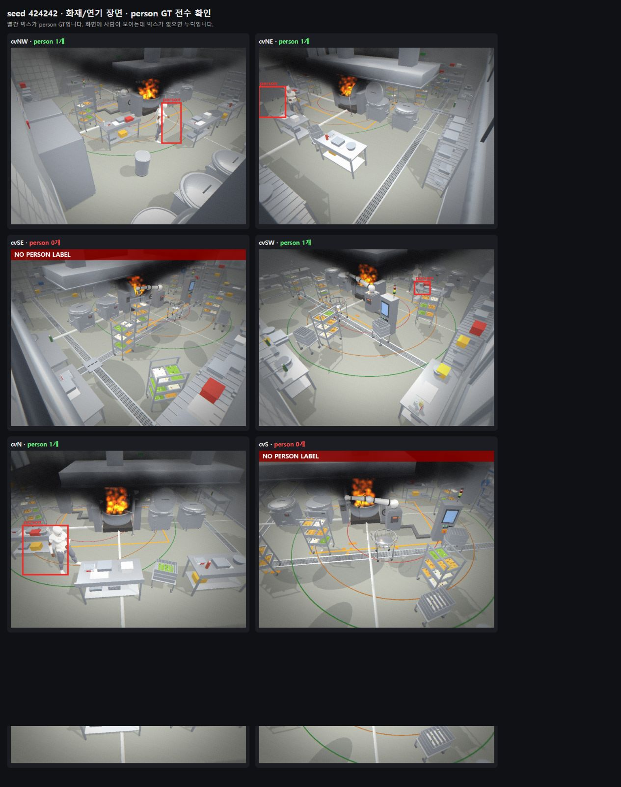

# PR #25·#26·#27 검토와 person 라벨 정렬 세션 보고서 (2026-08-26)

> 이 문서는 이번 세션에서 실제로 확인한 코드, 이미지, 실험, 실패한 가설, 테스트 결과와
> PR 처리 결론을 한곳에 모은다. 수치는 근거 수준을 구분한다. 저장소에 입력·설정·결과가
> 남은 값은 **재현 가능**, 로컬에서만 측정되어 원본이 보존되지 않은 값은 **예비 결과**다.

## 1. 최종 결론

- **PR #25는 필요하다.** 사선 카메라 person 라벨의 부풀림·팬텀·미라벨을 고치고, 재현 가능한
  분할 전 원본 생성기를 제공한다. RGB–GT 센서 좌표 정렬 수정은 PR #25에서 분리해 **PR #28**에 둔다.
- **PR #27은 현재 형태로는 병합하지 않는다.** 시뮬레이터의 6종 GT 전체를 person-only로
  축소할 필요는 없다. PR #25 원본에서 class 0(person)만 골라 같은 장면의 6개 카메라를
  같은 split에 넣는 작은 후속 도구로 다시 만드는 것이 맞다.
- **PR #26은 PR #25로 대체되지 않는다.** 4+1 카메라 BEV 융합·전역 ID·예측 기능이므로
  역할이 다르다. 다만 현재 PR #26의 검출기 gate가 낮아, person 검출기를 다시 학습하고
  독립 평가가 통과하기 전에는 병합하지 않는다.
- 병합/진행 순서는 **#25 → person-only 장면 단위 split·학습 → 검출 gate → #26 재검증**이다.

## 2. 각 PR에서 하려던 일

| PR | 역할 | 이번 세션 결론 |
|---|---|---|
| [#25](https://github.com/whatslung/robot-kitchen-safety-sim/pull/25) | 사선 GT 라벨 수정, 재현 가능한 원본 캡처, manifest·hash·실패 복구 | 먼저 병합 |
| [#26](https://github.com/whatslung/robot-kitchen-safety-sim/pull/26) | 4+1 카메라 스케줄링, BEV 좌표 통합, 전역 ID, K=3 예측 | 검출 gate 통과 후 재검증 |
| [#27](https://github.com/whatslung/robot-kitchen-safety-sim/pull/27) | GT·학습 설정을 person-only로 제한 | 현재 구현은 폐기/축소, split·필터 기능만 필요 |

PR #26의 낮은 recall이 PR #25·#27 때문이라고 단정할 수는 없다. PR #26의 baseline은
새 4+1 뷰에 맞춰 학습되지 않은 검출기를 측정한 값이다. PR #25의 라벨 결함은 새 학습 데이터의
품질을 떨어뜨리는 원인이지만, stock YOLO의 낮은 값까지 직접 설명하지는 않는다. PR #27은
클래스 계약 변경이므로 검출기가 새 뷰의 작은·사선 사람을 잘 보는 문제를 자체적으로 해결하지 않는다.

## 3. PR #25 코드리뷰에서 확인하고 고친 사항

초기 리뷰에서 나온 중요한 문제와 처리 결과:

1. 기존 출력 폴더에서 `manifest.json`을 먼저 덮어쓸 수 있음
   - 기존 결과가 있으면 시작 전에 거부하도록 변경했다.
2. 이미지와 라벨 확정 사이에 중단되면 한쪽 파일만 남을 수 있음
   - 장면 임시 디렉터리와 불완전 표식, 장면 단위 공개·rollback으로 보강했다.
3. person 정확색 경로에 거리 제한을 두면 큰 설비에 가려 멀리 갈린 실제 조각을 버릴 수 있음
   - 최종 person 경로는 `relativeMin: 0`이며 `maxGap`을 사용하지 않는다.
4. `classifyExact()`의 기본 허용치 계산 오류
   - 기본값 26을 먼저 확정한 뒤 제곱하도록 수정하고 회귀 테스트를 추가했다.
5. 반복 생성에서 Babylon 재질·애니메이션·스켈레톤이 누적될 가능성
   - 생성/해제 경계를 정리하고 실제 Chrome 반복 통합 테스트를 추가했다.
6. seed만 같아도 비동기 GLB 로드 순서가 결과를 바꿀 수 있음
   - 장면 RNG와 프롭 RNG를 분리하고, 입력 파일·런타임·결과 hash를 manifest에 기록했다.
7. 코드보다 문서가 sim-to-real·실배포 안전성을 강하게 주장함
   - 재현 입력이 없는 과거 수치는 예비 결과로 낮추고, simulator 결과를 실주방 안전 근거로
     사용하지 않도록 경계를 명시했다.

최종 재리뷰에서는 **Critical 0, Important 0**이었다. 마지막 Minor는 센서의 모든 열화값을
테스트에서 확인하라는 내용이었고, `grain`, `vignette`, `exposureJitter`까지 0인지 검증하도록 반영했다.

## 4. 이미지로 확인한 person 라벨

### 4.1 6카메라 전수 확인

seed `424242`, 화재·연기 장면을 실제로 생성해 여섯 카메라를 한 화면에서 확인했다.



- `cvNW`, `cvNE`, `cvSW`, `cvN`: 사람이 보이며 person 라벨 1개가 있었다.
- `cvSE`, `cvS`: 라벨이 0개였지만 원본 화면에도 사람이 보이지 않아 정상이다.
- 따라서 이 장면의 0개 라벨은 연기 때문에 사람을 놓친 사례가 아니었다. 연기를 제거할 필요도 없었다.

### 4.2 사용자가 찾아낸 RGB–GT 위치 어긋남

박스 유무만 보면 통과하지만 확대하면 `cvNE` 박스가 사람보다 왼쪽에, `cvN` 박스도 넓고 왼쪽에
치우쳐 있었다.


이 문제는 연기나 person 색 분류가 아니라 **RGB와 GT가 서로 다른 렌더 경로를 사용한 문제**였다.

### 4.3 최종 정렬

원본 학습 캡처에서 센서 파이프라인을 완전히 끄자 RGB와 GT가 같은 픽셀 좌표계를 사용했고,
사람 실루엣과 박스가 맞았다.


최종 코드로 다시 만든 960×720 원본에서 확인한 person 라벨:

| 카메라 | YOLO `(cx, cy, w, h)` | 픽셀 박스(대략) | 확인 |
|---|---|---|---|
| cvNE | `(0.158333, 0.307639, 0.093750, 0.175000)` | x=107–197, y=158–284 | 사람 전체를 감쌈 |
| cvN | `(0.230729, 0.561806, 0.146875, 0.277778)` | x=151–292, y=304–504 | 사람 전체를 감쌈 |

## 5. RGB–GT 어긋남 트러블슈팅

### 실패한 첫 가설

렌즈 왜곡·색수차·블러만 좌표를 움직인다고 보고 원본 생성에서 아래 세 값만 0으로 만들었다.

- `distortion = 0`
- `chroma = 0`
- `blur = 0`

manifest 검증 통합 테스트는 통과했지만, 실제 이미지를 다시 겹쳐 보니 박스가 여전히 어긋났다.
즉 **설정값 테스트 통과가 시각적 정렬을 증명하지 못했다.** 이 변경은 커밋하지 않았다.

### 확정한 원인

- RGB 패스: Babylon 렌즈/센서 후처리 파이프라인이 붙어 있음
- GT 마스크 패스: `gtOff()`가 `SENSOR.on=false`로 만들고 후처리를 떼어냄
- 결과: 값 일부를 0으로 해도 RGB와 마스크의 전체 렌더 경로가 달라 좌표가 달라짐

### 최종 해결

일반 시뮬레이터의 CCTV 효과는 그대로 두고, `tools/headless_gen/gen.cjs`의 **원본 학습 캡처만**
다음 상태로 고정했다.

```text
enabled=false
grain=0, distortion=0, chroma=0, blur=0
vignette=0, exposureJitter=0, lowResolution=0
```

이렇게 하면 여섯 카메라의 RGB와 GT 마스크가 캡처 내내 같은 렌더 경로를 쓴다. 센서 열화가
필요하면 향후 이미지와 박스를 함께 변환하는 오프라인 증강으로 적용해야 한다.

## 6. 그 밖의 트러블슈팅

| 증상 | 원인/판정 | 처리 |
|---|---|---|
| person 박스가 화면 전체로 부풀음 | 최근접색에 거리 상한이 없어 화재·연기 혼합 픽셀을 person으로 분류 | person만 정확색(±26)+연결성분 필터 |
| 팬텀 person 또는 보이는 사람 미라벨 | person 팔레트가 equipment 색과 가까움 | person·robot·kettle base 색을 먼저 예약 |
| 3D 투영 gate가 보이는 사람을 버림 | 스킨드 메시 world bbox가 장면 변경 후 오래된 상태 | 투영 gate 폐기, 정확색 경로 유지 |
| 반복 생성 중 늦게 로드된 프롭에서 오류 | 초기 base 위치에 해당 프롭이 없음 | 없는 프롭만 지연 등록 |
| 두 번째 이후 캡처가 단색 | 후처리 체인 재컴파일 완료 전에 다음 RGB 캡처 | `whenReadyAsync()` 기반 준비 대기 유지 |
| 장면 중간 실패 후 부분 파일 | 이미지·라벨·manifest 공개가 원자적이지 않음 | 장면 transaction과 rollback |
| 기존 Chrome을 건드릴 위험 | 다른 작업이 데이터 생성에 사용 중 | 생성기 전용 임시 프로필의 새 Chrome만 사용 |
| 최종 비교 페이지 새로고침 차단 | in-app Browser URL 보안 정책 | 우회하지 않고 최종 원본 PNG를 로컬 이미지 검사 |

## 7. 지표와 근거 수준

### 7.1 이번 PR에서 재현 가능한 검증

| 항목 | 결과 |
|---|---|
| 최종 단위 테스트 | 29/29 통과 |
| 실제 Chrome 통합 테스트 | 2/2 통과 |
| 센서 계약 보강 후 핵심 통합 테스트 | 1/1 통과 |
| 실제 생성 | seed 424242, 1장면×6카메라, 6쌍 저장 |
| 최종 sensor manifest | 모든 열화값 0, `lowResolution=0`, `enabled=false` |
| 최종 코드리뷰 | Critical 0, Important 0 |
| RGB–GT 정렬 수정 커밋 | `15f75b4` |

### 7.2 PR #26에 커밋된 예비 detector gate

동기화된 10장면×5뷰, 이미지 50장, person GT 35개, IoU 0.5 기준:

| 모델 | confidence | precision | recall |
|---|---:|---:|---:|
| 기존 나디르 fine-tune | 0.25 | 0.000 | 0.000 |
| stock YOLO11s | 0.25 | 0.174 | 0.114 |

이 값은 PR #26의 런타임 구조를 검증했을 뿐, 새 4+1뷰에서 usable detector임을 증명하지 않는다.
첫 10장면은 장면 seed가 보존되지 않아 정식 benchmark가 아닌 go/no-go 진단이다.

### 7.3 데이터와 학습 결과의 근거 수준 재감사

이번 세션의 최종 감사에서는 보정 합성 원본 660장을 장면 단위 train 564/val 96으로 나눈 사실과
6클래스 `results.csv`를 다시 확인했다. 독립 test는 없다. 보존된 전체 val recall은
YOLO11n@960 `0.7215`, YOLO11s@1280 `0.7705`다. person 전용 recall `0.344/0.409`는 당시
클래스별 평가 기록이지만 해당 출력 파일은 보존되지 않았다.

Chef1은 train 3,767/valid 1,074/test 546장이 보존돼 있다. 현재 CSV로 확인되는 valid person
recall은 real-only `0.9565`, sim-only `0.0261`, real+sim `0.9483`이다. 기존 test recall
`0.970/0.048/0.961`은 평가 출력이 남아 있지 않아 재평가 전까지 확정값으로 쓰지 않는다.

또한 `0.938`은 입력이 보존되지 않은 14장면·32명 세션 기록이다. 현재 `_fusion` 폴더는
12장면·29명으로 다른 데이터이므로 같은 결과의 재현 자산이라고 할 수 없다. 이 값은 BEV 전역 ID
융합 정확도나 ByteTrack recall도 아니다. 데이터 장수, 클래스별 박스 수, 전체 지표 표는
[`2026-08-26-label-fix-summary.md`](2026-08-26-label-fix-summary.md)를 기준으로 한다.

## 8. 최종 남은 작업

1. PR #25 병합
2. PR #25 raw manifest를 입력으로 같은 장면 6카메라를 같은 split에 배치
3. split 시 YOLO class 0(person)만 복사하고 `data.yaml`을 person-only로 생성
4. 잠긴 test split에서 person detector precision·recall 재측정
5. detector gate 기준을 정한 뒤 PR #26을 최신 main 위에 rebase
6. detector→카메라별 ByteTrack→BEV 전역 ID→예측을 끝까지 평가

PR #27의 현재 simulator-wide person-only 변경은 위 2·3번의 작은 도구로 대체하는 것이 좋다.

## 9. 관련 문서와 제외 자산

- 상세 기술 문서: [`2026-08-26-oblique-label-fix-and-sim2real.md`](2026-08-26-oblique-label-fix-and-sim2real.md)
- 라벨/학습 요약: [`2026-08-26-label-fix-summary.md`](2026-08-26-label-fix-summary.md)
- 원본 생성기: [`tools/headless_gen/README.md`](../../../tools/headless_gen/README.md)
- 회귀 테스트: [`tests/browser/`](../../../tests/browser/)

`scratch_verify/`와 `tools/headless_gen/diag_phantom.cjs`는 진단용이라 커밋하지 않는다. 문서에서
사용한 세 장의 스크린샷만 `docs/chanwoo/handoff/img/06-08`로 복사해 근거로 보존한다.
