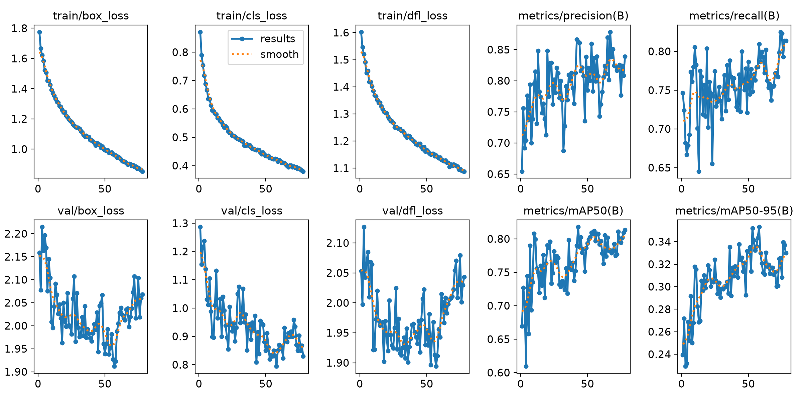
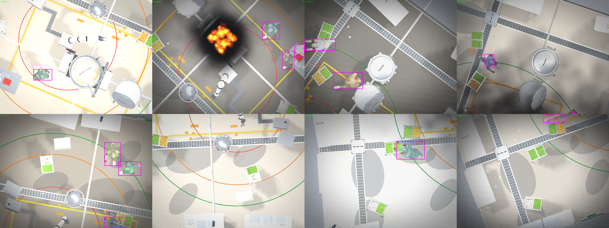
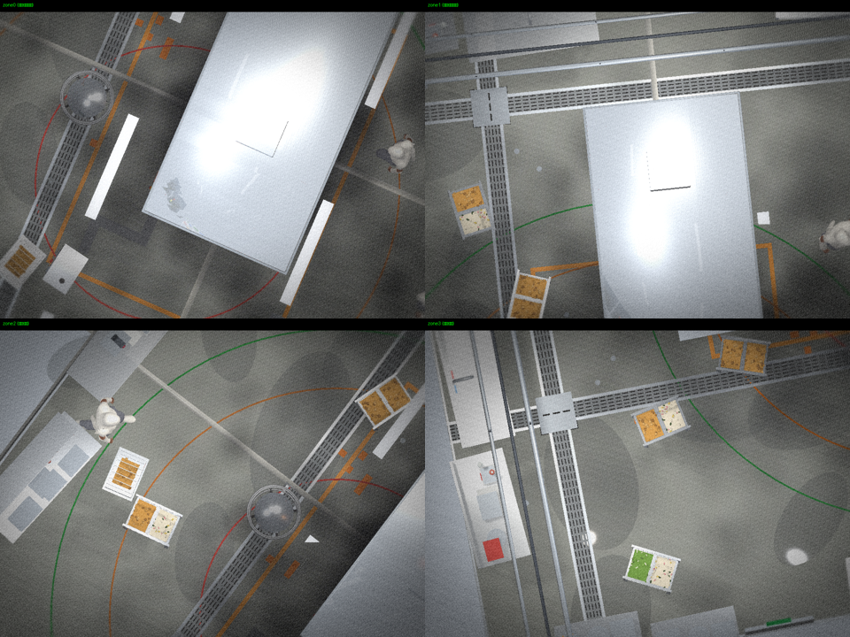
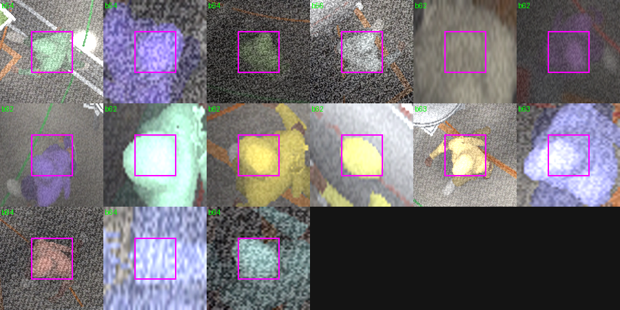
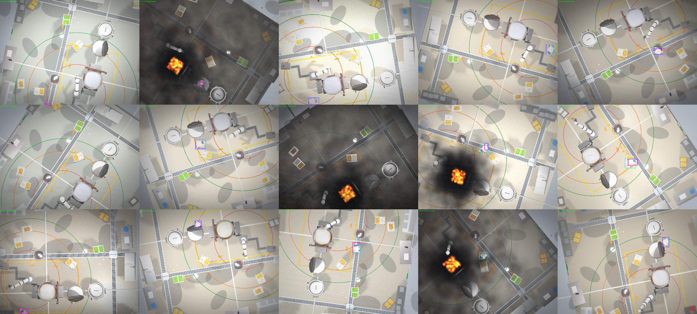
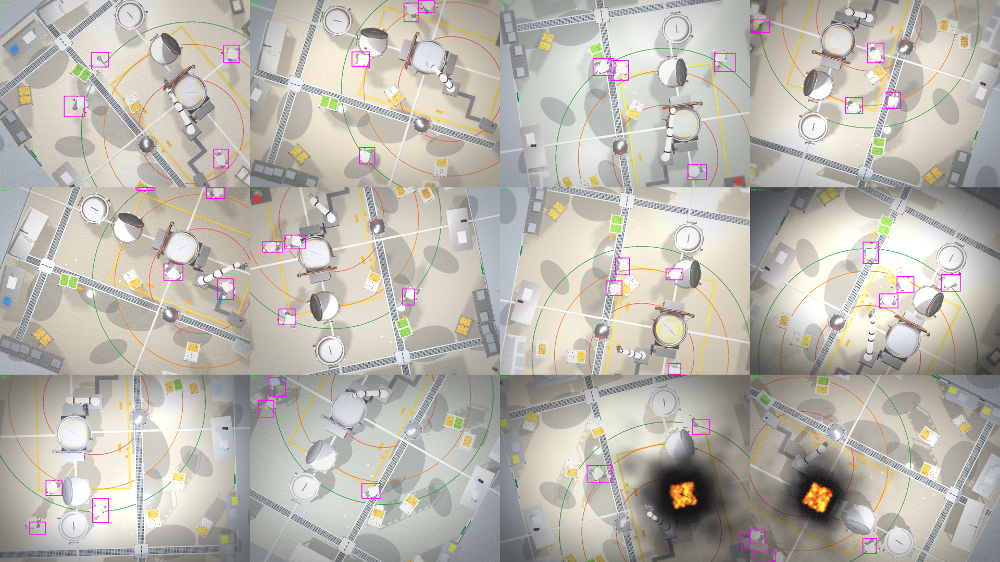

# 나디르(top-down) Person 검출기 — 헤지 경로 R&D 정리

> 작성 2026-08-26 · 브랜치 `claude/handoff-nadir-yolo-b4b5cd`
> 단일 나디르 카메라 → GT 버그 수정 → 다양성 → 4구역 스케일 → 4캠 융합까지의 전 과정.

---

## 1. 목적 / 배경

주력 안전 경로는 **사선(oblique) CCTV + 멀티카메라 융합**이지만, 사선은 호모그래피·발목
포즈·가림 리스크가 있다. 그 보험(헤지)으로 **나디르(천정 직하) 검출기**를 같은 eval로
확보한다. 나디르 장점: 이미지≈바닥이라 **좌표가 거의 공짜**(호모그래피·포즈 불필요), 사람이
서로 덜 가림.

안전 시스템(`trajectory/risk.py`)은 **사람 위치만** 비전으로 필요하다(로봇은 컨트롤러가,
설비는 고정 맵이 위치를 앎) → 검출기는 **person 1클래스**로 충분.

**목표**: 나디르 도메인 person recall을 최대한 높이고, 사선 경로와 같은 방식으로 평가.

---

## 2. 데이터셋 — 무엇을, 몇 장, 어디서, 어느 용도

`dataset/*`·`training/`은 gitignore(HF/로컬 관리). 재현은 결정적 재생성(seed 고정)·스크립트로.

### 2-1. real (실사, 대리 도메인)
| 이름 | 장수 | 출처 | 용도 |
|---|---|---|---|
| `overhead-person-v3` | **4,258** | Roboflow `riccardo-kxtut/overhead-person-szky0` v3 (CC BY 4.0) | 실사 오버헤드 사람. 실사 전이 확인·학습 |

- **누수 방지 재분할**(P0-1 교훈): Roboflow 기본은 프레임 랜덤 분할이라 같은 클립이
  train↔test에 새는데(recall 부풀림), **클립 단위**로 재분할 → train 3,389 / val 325 / test 544.
- ⚠️ 이건 **우리 배포 카메라가 아니라 범용 참조**다. 프레이밍이 좁아 사람이 큼(면적 1.2%).

### 2-2. sim (합성, 우리 나디르 도메인) — 진화 과정
| 이름 | 장수 | 특징 | 용도 |
|---|---|---|---|
| `sim-person-island-v2` | 200 | wide 나디르, **GT 오라벨 수정본**(tol+연결요소), 흰옷 | 1차 |
| `sim-person-island-v3` | 478 | wide 나디르, **다양성 틴트**·왜곡제거·후드제거·freeze | 2차 (imgsz 960) |
| `sim-nadir-zone` | **340** | **4구역(2×2)**, **현실 옷색 틴트**, 연기 완화, 큰 사람(1.45%) | 3차 (본 경로) |
| `fusion-test` | 160 | **40씬 × 4대 동시** + 사람 id | 4캠 융합 평가 |

전부 sim.html의 orthotop(직교 나디르) 카메라를 GT 캡처(`groundTruth`)로 생성 →
`train/gen_*.js` 콘솔 스니펫 참조. sim은 **무한·무료·정확라벨**(라벨이 렌더 GT에서 나옴).

### 2-3. person-only split (학습에 실제 쓴 것)
| split | train | val | test |
|---|---|---|---|
| `nadir-person` (wide, v3 기반) | mix 3,723 (real 3,389 + sim 334) | 397 | zone/real 도메인별 |
| `nadir-zone` (4구역, zone 기반) | real 3,389 + **zsim 237** | zsim 52 · real 325 | **zsim 51** · real 544 |

- **도메인별 test 분리**(sim/zone 따로, real 따로) — sim만 잘 되고 실사 못 하면 무용지물이라.
- sim은 6클래스 라벨에서 **person(class 0)만 필터** → nc:1. real은 원래 nc:1.
- 스크립트: `train/prep_nadir.py`(wide), `train/prep_nadir_zone.py`(zone).

---

## 3. 트러블슈팅 — 발견하고 고친 문제들

### 3-1. GT 거대 오라벨 (핵심 버그)
- **증상**: 200장 중 8장에서 person 박스가 **케틀·장비·빈 바닥을 통째로** 감쌈(화면의 최대 93%).
  학습 시 "빈 공간=사람" 오검출 유발.
- **원인**: `nearestColorKey`가 주석이 약속한 **tol(거리 임계값)을 실제로 구현 안 함** →
  두 개체 경계의 MSAA 혼합 픽셀이 제3의 개체 색(특히 색공간 중앙의 회색)으로 오분류 →
  그 개체 min/max 박스가 화면 전체로 번짐.
- **재렌더로 확증**: tol 유무 A/B로 person 박스 area 0.042→0.007 토글 확인.
- **수정**: ① `NEAREST_TOL2=900` 절대 거리 tol 추가, ② 인스턴스 bbox를 전 픽셀 min/max →
  **최대 4-연결요소**로(tol로 못 막는 케이스까지 차단). → `sim.html` 커밋 `cfa6bbf`.

### 3-2. 라벨-RGB 정렬 오차
- **증상**: 박스가 사람에서 살짝 어긋남(중앙값 확인 필요했던 이슈).
- **원인**: **SENSOR 렌즈 왜곡(distortion)이 RGB에만 걸리고 마스크엔 안 걸림** → 왜곡된 RGB와
  안 왜곡된 마스크 라벨이 어긋남(가장자리일수록 큼).
- **수정**: 생성 시 `SENSOR.distortion=0; chroma=0`. 실측 오프셋 중앙값 3.6px(사람의 6%)로 축소.
- 추가로 **모션 오프셋**(걷는 사람이 RGB패스↔마스크패스 사이 이동) → `gtFreeze`(캡처 순간
  이동·애니 정지)로 제거. → `sim.html` 커밋 `82c5fe4`.

### 3-3. 작은 사람 (스케일)
- **증상**: wide 나디르(8.9×6.7m)는 사람이 프레임의 **0.6%(~59px)** → 검출·위치정밀도 약함.
- **수정**: **조리실을 2×2 구역으로 분할**, 각 카메라가 5.8×4.3m만 담음 → 사람 **1.45%(~107px)**,
  real 스케일 이상. mAP50-95 0.30→0.53(위치정밀도 2배). → 커밋 `493f818`.

### 3-4. 후드/덕트 가림 (나디르의 물리적 한계)
- **발견**: 조리라인 **후드 캐노피**(x[-1.6,4.1]·z[-1.1,1.0], 높이 2.2~2.6m)가 남쪽 두 구역의
  **로봇 작업공간을 가림** — 사람(1.6m) < 후드(2.2m) < 카메라(3.9m).
- **의미**: 나디르 카메라를 몇 대 놔도 다 위에서 보니 후드 아래는 못 봄. 하필 그곳이 안전-핵심 구역.
  **사선을 주력으로 택한 이유.** (후드 아래 카메라는 바닥은 보이나 솥·로봇이 사람을 가려 깔끔치 않음.)
- **현재 조치**: 개방구역 검증을 위해 `noCeil`(layerMask & ~CEIL_BIT)로 후드 제거하고 진행.

### 3-5. 틴트 현실성
- **발견**: saturated 랜덤색(보라·녹색) 사람을 실사·구형 sim 모델이 전혀 인식 못 함(recall 0.0) →
  틴트가 비현실적이면 도메인이 갈림.
- **수정**: **실제 조리복 팔레트**(흰·감청·검정·회색·갈색·카키·청록 앞치마)로 교체. → 커밋 `9ae2536`.

### 3-6. 연기 라벨 의심 → 검증
- **의심**: 연기에 가린 사람도 라벨돼 recall이 부당하게 낮은가?
- **검증**: 밝기 2.2배 보정하니 **대부분 흐리게라도 사람 존재** → 라벨은 유효, 진짜 하드케이스였음.
- **조치**: 다만 화재 프레임이 `FIRE_FOG`(전체 어둡게)로 너무 어두워 → **생성 시** `FIRE_FOG.max`
  0.22→0.08, `fsmoke α` 0.18→0.09로 완화(기본값은 데모용으로 유지). 밝기 54→131로 개선.

### 3-7. 비율 희석
- **발견**: sim이 학습의 2.4%면 real에 묻혀 zone recall 0.55. sim-only면 0.76.
- **확인**: real 양을 줄여 sim 비율↑ → zone recall 0.55→0.65→0.76(상승), real recall 하락(시소).
- **결론**: **충분한 고유 데이터**(237장)면 낮은 비율(7%)에서도 zone 학습 → 둘 다 높음.
  업샘플/가중은 과적합이라 비추천, **더 많은 고유 데이터가 정석**.

### 3-8. 기타
- **Windows DataLoader 재실행 행**: 평가 스크립트에 `if __name__=="__main__"` 가드 + `workers=0` 필수.
- **cy 좌표 규약**: 라벨은 top-origin(표준 YOLO) — 융합 평가 시 확인(top 0.84 vs bottom 0.07).

---

## 4. 설계 방향의 진화

```
wide 단일 나디르 (사람 0.6%, 흰옷)
  └─ GT 오라벨 수정 (tol + 연결요소)
      └─ 다양성 틴트 + 왜곡제거 + freeze
          └─ imgsz 960 (작은 사람 대응)  ──►  sim 0.81 / real 0.84
              └─ 4구역 분할 (사람 1.45%, 근본 스케일 해결)
                  └─ 현실 옷색 틴트 (실사 전이)
                      └─ 연기 완화 (화재 하드미스↓)
                          └─ 비율 균형 (충분한 데이터)  ──►  zone 0.86 / real 0.83
                              └─ 4캠 융합 (겹침 이중화)  ──►  유효 0.92
```

핵심 통찰: **나디르는 개방구역엔 탁월**(사람 크고 선명)하나 **후드 아래는 물리적으로 못 봄** →
사선과 조합이 맞다. 단일 검출을 아무리 올려도 커버리지 한계는 **융합·다중 센서**로 뚫는다.

---

## 5. 지표 (전체 실험)

### 5-1. wide 경로
| 모델 | sim recall | real recall | 비고 |
|---|---|---|---|
| v2 wide 640 (baseline) | 0.665 | 0.852 | GT수정 후 |
| v2 업샘플 ×8 | 0.609 | 0.811 | 과적합(precision↑ recall↓) |
| **v3 wide + imgsz 960** | **0.810** | 0.837 | mAP50 0.889 |

### 5-2. zone 경로 — 비율 스윕 (zsim 237 고정)
| real | sim % | zone R | zone P | zone mAP50 | zone mAP50-95 | real R | real P |
|---|---|---|---|---|---|---|---|
| 3389 | 7% | **0.862** | 0.923 | 0.906 | 0.53 | **0.830** | 0.846 |
| 700 | 25% | 0.894 | 0.981 | 0.907 | — | 0.780 | 0.805 |
| 237 | 50% | 0.879 | 0.859 | 0.900 | — | 0.633 | 0.753 |

- **best = real 3389 + zsim 237 (7%)**: zone 0.862 / real 0.830 (둘 다 최고 균형).
- 낮은 conf(0.02~0.25)에서 recall **flat**(0.86) → 놓친 건 하드미스, 운영점으론 못 살림.

### 5-3. 4캠 융합 (fusion-test 40씬)
| | recall |
|---|---|
| 단일 카메라 (라벨 326개) | 0.831 |
| **4대 융합 (고유 191명, "한 대라도 잡으면")** | **0.916** |

**한 카메라가 놓친 사람을 겹치는 다른 카메라가 잡음** → 유효 recall 0.83→0.92, 놓침 절반.
0.99 미달 이유: 구역 중앙(1대만)은 그대로 + 상관된 실패 + 겹침 ~30%.

### 5-4. loss / 학습 곡선

seed=42 결정적, patience 조기종료. batch 자동(-1), imgsz 640/960.

### 5-5. 융합 상한 — 겹침 키우기 (9대 3×3, dataset/fusion9-test)
같은 씬 30개를 9대(3×3, 큰 겹침)로 촬영해 겹침을 키우면 융합 recall이 상한에 가는지 측정. best=sweep_r3389.
| 구성 | recall |
|---|---|
| 단일 카메라 | 0.844 |
| 4대 모서리 융합 | 0.859 |
| 9대 융합 | 0.895 |

겹침을 두 배 넘게 키워도 **상한은 ~0.9에서 정체**(독립이면 0.99+). 원인 = **놓침 상관성**: 여러 대가 같은 사람을 봐도 같이 놓친다(k=3 노출 실제 융합놓침 0.091 vs 독립가정 0.004 → 20배). 어려운 사람(연기·후드/로봇팔 가림·프레임 가장자리)은 그를 보는 **모든** 카메라가 다 놓침 → 공간 겹침만으론 안전등급(0.99) 불가. 상한을 깨려면 다른 축(시간)이 필요.

### 5-6. 시간축 추적 (연속 클립, 사람 id 고정)
사람이 움직이는 하나의 연속 클립을 한 대로 찍어, 프레임별 검출(RAW) vs 추적으로 잠깐 놓친 프레임 메우기 비교. BRIDGE=앞뒤 K 이내 검출 있으면 메움(시간축 상한). 마스크 패스가 안개를 꺼 라벨은 유효.
| 클립 | RAW (precision) | ByteTrack (precision) | BRIDGE(상한) |
|---|---|---|---|
| easy 존 (사람 큼) | 0.943 (0.995) | **0.960 (0.957)** | 0.971 |
| hard 넓은뷰 (사람 작음) | 0.778 (0.529) | 0.791 (0.457) | 0.874 |

- **놓침 대부분이 '잠깐 놓침'**(BRIDGE ≫ RAW) → 시간축엔 큰 여지. 공간 융합(놓침 상관→0.9 정체)과 정반대로, 시간 놓침은 덜 상관됨.
- 단 **좋은 검출 운영점에서만 살릴 수 있음**: 넓은뷰는 검출기 자체 precision 0.53(오탐 절반)이라 어떤 추적기도 못 살림. 존에선 ByteTrack이 RAW→상한 격차의 ~65%를 **정밀도 0.96 유지**하며 메움.
- 단순 IoU 추적기는 precision 붕괴(존 0.84 vs ByteTrack 0.96) — 칼만+2단계매칭의 제대로 된 추적기가 필요.

### 5-7. 세 축 결합 (존 4대 연속 클립, dataset/combo)
존 카메라 4대(겹침)가 **같은 연속 클립** 50스텝을 촬영. 사람 id는 카메라·시간 모두에서 고정 → 공간·시간을 한 번에 결합.
| 단계 | recall | 상승 |
|---|---|---|
| 단일 카메라·단일 프레임 | 0.848 | — |
| +공간융합 (4대 중 하나라도) | 0.894 | +0.046 |
| **+시간축 추적 (인과 coast K=5)** | **0.950** | +0.056 |
| BRIDGE (공간+시간 상한) | 0.979 | |

**공간융합은 예상대로 ~0.9에서 멈추지만, 시간축을 얹으면 그 벽을 넘어 0.950**(상한 0.979 근접). 시간축 상승폭(+0.056)이 공간(+0.046)보다 큼 — 시간 놓침이 공간 놓침보다 덜 겹치기 때문. **존(좋은 검출) → 공간 융합 → 시간축 추적**, 세 축이 서로의 사각을 메운다.
※ 위 0.950은 카메라 간 사람 연결을 GT id로 완벽 가정한 **이상치**다. 실제 배포 수치는 5-8 참조.

### 5-8. 배포 파이프라인 (recall 우선 추적기, `train/nadir_tracker.py`)
안전에선 놓침이 오탐보다 위험하므로, **검출은 저신뢰(conf 0.15)로 전부 살리고 추적기는 'id 부여 + 잠깐 놓친 프레임 coast'에만** 쓴다(ByteTrack을 그대로 쓰면 자체 게이팅이 저신뢰 검출을 버려 base recall이 깎임, 5-6). SORT형 칼만+IoU 헝가리안, 확정(2회) 트랙만 coast(precision 보호), coast는 K=5로 제한.
| | RAW(검출만) | +추적기(검출+coast) |
|---|---|---|
| 단일 존 클립 (recall/prec) | 0.982 / 0.945 | **0.988 / 0.855** |
| combo 4대 단일 (recall/prec) | 0.848 / 0.43 | 0.858 / 0.36 |
| **combo 4대 커버리지 OR** | — | **0.900** |

- 단일 카메라 배포는 **base recall(0.982)을 그대로 유지**하면서 coast로 0.988 + 안정 id.
- 4대 **커버리지 OR = 0.900**이 카메라 간 re-id 없이 얻는 **현실 배포 수치**. 5-7의 0.950(이상치)과의 격차(0.05)는 곧 **카메라 간 트랙 연결(월드좌표 융합)의 값**이다.

### 5-9. 카메라 간 트랙 연결 — 월드좌표 융합 (combo2 캘리브레이션, `train/combo_world_eval.py`)
5-8의 격차(연결 없음 vs 이상치)를 실제로 좁힐 수 있는지 측정. combo2 재생성: 메타에 **사람 월드좌표(한 순간 스냅샷) + 카메라 `world_matrix`** 저장, 4대를 같은 프레임에 캡처. 카메라별 아핀(이미지 cx,cy→바닥 X,Z)을 GT로 1회 피팅(=캘리브레이션, 잔차 3대 **5~6cm**·cam0 0.21m). 검출을 월드로 매핑 → 프레임별 pool → 근접(0.4m) 병합 → **월드공간 단일 추적기**(거리게이트 그리디+등속+coast)로 카메라 간 트랙을 하나로 연결.
| 매칭반경 | 단일 | 커버리지 OR(연결 없음) | 월드 융합(연결) |
|---|---|---|---|
| 0.6m | 0.895 | 0.924 | **0.940** |
| 0.5m | 0.871 | 0.876 | **0.918** |
| 0.4m | 0.871 | 0.874 | **0.914** |

- **카메라 간 월드 연결이 커버리지 OR 대비 recall을 올림**(+0.016~+0.042), 이상치(GT-id 완벽연결) 0.950에 근접 → 실제 추적기가 이상적 융합 이득의 대부분을 realize.
- **좁은 반경(0.4~0.5m)일수록 이득이 더 큼(+0.04)** — 칼만 스무딩이 위치를 안정화해, 흔들리는 생검출보다 트랙 위치가 정확. 즉 월드 융합은 **빈 프레임 메우기 + 위치 안정화** 둘 다 한다.
- 아핀 잔차 5cm → **4대 동시 캡처에 드리프트 없음** 확증(옛 combo의 카메라 간 3.8m 어긋남은 순전히 축 추정 오류였고 드리프트 아니었음, 5-7 결과 안전).
- 필요 조건: 카메라 **캘리브레이션**(직교 나디르는 이미지↔바닥 아핀 1회 피팅으로 충분).

### 5-10. 커버리지 — 사각지대는 실재, 남쪽 마진 국소 수정
combo2에선 4대 커버리지 안에 사람이 다 들어와 사각 0이었지만 **이는 seed 우연**. combo3(다른 seed)에선 사람이 **남쪽 z=−3.46까지 몰렸다**. 옛 설정(spanZ 4.3, 남쪽 끝 −2.75)이면 이 구역이 통째로 사각.
| combo3 | 값 |
|---|---|
| 사람 z 범위 | −3.46 ~ 0.61 (전부 남쪽) |
| 남쪽 마진존(z<−2.75) 사람관측 | **109 / 224 (49%)** |
| └ 마진 수정 후 검출 | **90 (0.83)** |

- **국소 수정**(남쪽 두 대 z −0.6→−1.0, spanZ 4.3→4.6 → 남쪽 끝 −3.3, 사람 107→98px)만으로 그 109명 중 90명을 건짐 — 줌아웃(사람 85px, 검출 손해)이나 6대(하드웨어) 없이.
- 교훈: **줌아웃은 커버리지 이득 없이 검출만 깎는다**(combo2는 이미 사각 0). 진짜 필요한 건 **로밍 범위를 덮는 카메라 배치**이고, 부족한 축(여기선 남쪽 z)만 국소로 늘리면 된다. 사람 분포가 seed마다 극단적으로 달라, 커버리지는 **최악 로밍 범위** 기준으로 잡아야 한다.

### 5-11. 로밍 범위 측정 → 카메라 수 결정 (4대 vs 6대)
"6대로 늘릴까"를 추측 대신 데이터로 답하기 위해, 15개 seed에서 사람을 로밍시켜 위치 분포를 측정(4380 샘플).
- **전체 로밍 범위**: x∈[−5.0, 4.9], z∈[−4.7, 4.9] ≈ **10×9.6m** (배치 ±2.6보다 훨씬 넓음 — 사람이 멀리 배회). 현재 4대 커버 밖 13%.
- **그러나 커버 밖 13%는 전부 ±3.5m 바깥**(식당·통로 = 로봇에서 먼 곳). 안전-핵심 구역(로봇 근접)만 보면:

| 안전존(원점 기준) | 샘플 | 현재 4대 커버 밖 |
|---|---|---|
| ±2.6m (조리 셀) | 1888 | **0%** |
| ±3.0m | 2517 | **0%** |
| ±3.5m | 3046 | **0.6%** |
| ±4.0m | 3590 | 5.4% |

- **결론: 로봇 근접 안전 구역(±3~3.5m)은 현재 4대(마진 수정)가 완전히 덮는다 → 6대 불필요**(6대는 식당 쪽 먼 구역만 더 덮음, 안전엔 오버엔지니어링).
- 6대가 정당화되는 유일한 경우 = 안전 대상이 **주방 전체(대피 경로 등)**일 때. 감시 목적(로봇 근접 위험 vs 전체 대피)을 먼저 확정해야 카메라 수가 정해진다.
- 순서 교훈: **로밍 범위(싼 측정)를 먼저** → 카메라 수·배치를 데이터로 결정. 카메라 수를 먼저 추측하지 말 것.

### 5-12. 감시 목적 = 움직임 예측/회피 → 커버리지 반경 재계산 (6대 정당화)
감시 목적이 확정됨: **사람 움직임 예측 + 로봇 회피 기동**. 이건 커버리지 요구를 "근접"에서 "예측 도달 반경"으로 바꾼다. 시뮬의 실제 안전 모델(ISO/TS 15066 SSM, sim.html:4744~):
- 정지링 **3.10m**, 감속링 **3.90m**, 사람속도 v_h **1.6 m/s**, 예측 지평 **1.6s**(PRED.horizon).
- 예측/회피는 "곧 위험구역에 들어올 사람"을 잡아야 함. 최악(직진 접근) 예측 도달 반경 = 정지링 + v_h×지평 = 3.10 + 1.6×1.6 = **~5.7m** → **±5m 접근자를 미리 추적**해야 1.6s 예측 성립.

**결론(5-11 갱신)**: 단순 근접(±3.5m)이면 4대로 충분했지만, **예측/회피는 ±5m 접근 디스크가 필요 → 4대(±3.5m 견고)로 부족 → 6대(2열×3행)가 정당화**된다. 존 스케일(사람 큼) 유지하며 ±5m 디스크를 덮으려면 2×3 배치.
- 지배항이 **검출 지연**(사람이동 0.88m의 절반)이라 빠른 추론·낮은 추적 지연이 곧 안전거리 단축(프로젝트 논지). 나디르(정확 바닥 위치, 5cm)+월드 융합 추적(연속 속도/방향)이 예측을 직접 지원.
- 단위 주의: 링(m)과 씬 좌표(AU)의 환산 SCALE.mPerAU는 미검증(±25%). 실배포 전 실측 보정 필요.

---

## 6. 이미지

### 6-1. 라벨링된 zone 프레임 (4구역, 현실 옷색, 연기 완화)

사람이 크고(1.45%) 색이 다양(현실 조리복). 박스가 사람에 정확히 맞음. 거대박스 0.

### 6-2. 각 카메라 뷰 (4구역) + 후드 가림

남쪽 2구역(위)에 흰 후드 캐노피가 로봇 작업공간을 가림 — 나디르의 물리적 한계.
북쪽 2구역(아래)은 개방돼 사람 잘 보임.

### 6-3. 연기 완화 전/후 검증

어두운 연기 프레임을 밝게 보정하니 사람이 흐리게 존재(라벨 유효). 이후 FIRE_FOG 완화로 개선.

### 6-4. GT vs 모델 예측 (자홍=GT, 시안=예측)

라벨은 정확, 예측이 대부분 겹침. 놓침은 연기·소형 인물 등 하드케이스.

### 6-5. wide v2 라벨 몽타주 (수정본)


---

## 7. 결론 & 다음 작업

### 결론
- **나디르 4구역 + 융합 접근이 데이터로 검증됨**: 단일 zone 0.86, **4캠 융합 0.92**.
- sim(zone) 0.86 · real 0.83 — 두 도메인 균형. 위치정밀도(mAP50-95 0.53)도 wide 대비 2배.
- **공간 겹침만으론 상한 ~0.9**(9대까지 키워도 0.895) — 놓침이 카메라끼리 상관되기 때문(5-5).
- **시간축이 그 벽을 깬다**: 시간 놓침은 덜 상관돼, 세 축 결합 시 **0.848 → 0.894(공간) → 0.950(시간)**, 상한 0.979 근접(5-7). 단 시간축은 **좋은 검출 운영점(존) 위에 얹어야** 살아난다(넓은뷰는 검출 precision 0.53이라 추적기도 무력, 5-6).
- **배포 파이프라인**(5-8·5-9): recall 우선 추적기(저신뢰 검출 유지+coast+id)로 단일 0.988. 카메라 간 **월드좌표 융합**으로 커버리지 0.924→**0.940**(이상치 0.950 근접), 캘리브레이션 아핀 잔차 5cm.
- **한계**: 후드 아래(안전-핵심)는 나디르로 못 봄 → 사선/전용센서 조합 필요.
  현 수치는 합성 test 기준 — **실제 조리실 나디르 영상 평가는 미실시.**

### 다음 작업
1. ✅ **겹침 확대 → 융합 상한 측정 (완료, 5-5)**: 9대까지 키워도 ~0.9 정체, 원인=놓침 상관성.
2. ✅ **시간축 추적 (완료, 5-6·5-7)**: 결합 recall 0.950(상한 0.979). ByteTrack이 정밀도 0.96 유지하며 격차 ~65% 메움.
3. ✅ **실배포 파이프라인화 (완료, 5-8, `train/nadir_tracker.py`)**: 저신뢰 검출 유지 + 확정트랙 coast + id 부여. 단일 0.988, 4대 커버리지 OR 0.900(현실 배포 수치).
4. ✅ **카메라 간 트랙 연결(월드좌표 융합) (완료, 5-9, `train/combo_world_eval.py`)**: 캘리브레이션+월드공간 추적기로 커버리지 0.924→**0.940**(이상치 0.950 근접), 좁은 반경에선 +0.04. 위치 안정화 효과도 확인.
5. ✅ **커버리지 — 남쪽 마진 국소 수정 (완료, 5-10)**: 사람이 z=−3.46까지 로밍 → 옛 남쪽끝 −2.75면 49% 사각. spanZ 4.3→4.6·남쪽중심 −1.0으로 −3.3까지 덮어 90/109 건짐. (극단값 −3.46엔 살짝 못 미침 → spanZ 5.0/중심 −1.2면 완전.)
6. ✅ **로밍 범위 측정 → 카메라 수 결정 (완료, 5-11)**: 로밍 10×9.6m지만 안전존(±3.5m)은 4대가 0.6% 밖으로 완전 커버 → **6대 불필요**(감시가 로봇 근접이면). 주방 전체 대피 감시면 6대+.
7. ✅ **감시 목적 확정 = 예측/회피 (완료, 5-12)**: 예측 도달 반경 ~5.7m → ±5m 커버 필요 → **6대(2열×3행) 정당화**.
8. **6대(2열×3행) 배치·생성 → 예측 리드타임 커버리지 검증**: ±5m 디스크에서 접근자가 감속링(3.9m) 전에 속도 추정될 만큼 일찍 추적되는지.
9. **AU→m 스케일 실측 보정**(SCALE.mPerAU 미검증 ±25%) — 안전거리 절대값의 전제.
10. **실제 조리실 나디르 영상**으로 도메인 검증(현재 합성 test만).
11. (조건부) 후드 아래 안전-핵심 구역은 사선/서브후드 카메라와 조합.

### 재현 스크립트
- `train/prep_nadir.py`, `train/prep_nadir_zone.py` — split 구성
- `train/gen_nadir_console.js`, `train/gen_zone_console.js`, `train/gen_temporal_console.js` — 브라우저 생성 스니펫
- `train/train_nadir.py`(`--imgsz`), `train/train_nadir_zone_sweep.py` — 학습·비율 스윕
- `train/fusion_eval.py` — 4캠 융합 평가
- `train/fusion9_eval.py`, `train/fusion9_corr.py` — 9대 융합 상한·놓침 상관성 (5-5)
- `train/temporal_eval.py`, `train/temporal_track_eval.py` — 시간축 추적(단순 coast·ByteTrack) (5-6)
- `train/combo_eval.py` — 세 축 결합 사다리 (5-7)
- `train/nadir_tracker.py` — recall 우선 배포 추적기(칼만+IoU, 검출유지+coast+id) (5-8)
- `train/combo_world_eval.py` — 카메라 간 월드좌표 융합 추적(캘리브레이션 아핀+월드 추적기) (5-9)
