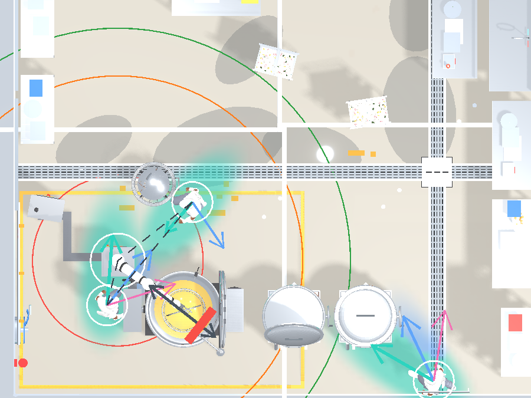
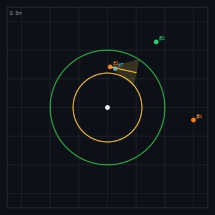
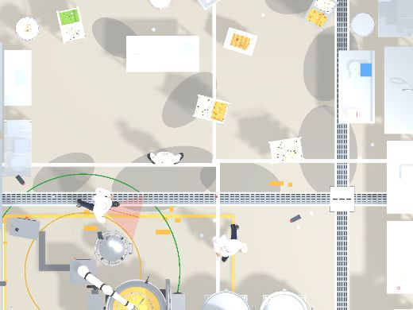

# LSTM 예측 모델 — 학습 설정

> 사슬에서 **예측**(사람이 앞으로 갈 곳 맞히기) 담당. 최근 발자국을 보고 4.8초 뒤까지 3갈래로 예측한다.
> 성능 결과는 [../model-scorecard.md](../model-scorecard.md), 상세 평가는
> [../prediction-eval.md](../prediction-eval.md) · [../prediction-safety-eval.md](../prediction-safety-eval.md).

## 데이터 — 몇 개 썼나

이미지가 아니라 **사람의 이동 궤적**이 데이터다. 단위는 "장"이 아니라 장면(scene)과 윈도우(window).

| 용도 | 데이터 | 수량 |
|---|---|---|
| **학습(train)** | 시뮬 궤적 윈도우 | **32,488** (노이즈 증강 전 원본) |
| **검증(val)** | 시뮬 궤적 윈도우 | **8,646** |
| **시험(test)** | 실사 zero-shot 스파이크 | 학습 **0** (전이만 확인) |

- 원본 궤적 파일 = **120 scene**. 각 scene = 사람 3명이 60초(150스텝·0.4초 간격) 돌아다닌 (x,z) 발자국.
- 이 발자국을 **관측 8스텝(3.2초) → 예측 12스텝(4.8초)** 윈도우로 슬라이딩하며 자른다.
  → train 32,488 / val 8,646 (합 41,134, val 약 21%).
- **학습에 실사 궤적은 0개.** 시뮬로만 학습한 뒤 실사에 그대로 적용(zero-shot)해 전이 여부만 봤다.
- LSTM은 기성품이 없다 — 이 문제 전용이라 처음부터 학습. 그래서 "원본 vs 우리"가 아니라
  "옛 단순법(등속·칼만) vs 학습형"이 비교 대상이다.

### 데이터셋이 어떻게 생겼나

이미지가 아니라 **사람의 발자국 좌표**다. 파일 하나 = 한 장면(scene), JSON 형식.

```
장면 (파일 1개, 예: island_h58_seed10_0009.json)
├─ 메타: layout·room·robot 위치 · hz 2.5 · dt 0.4s · steps 150 · wf:true
└─ nodes: 사람 3명
   ├─ id: "extra_0" · job: "prep" · role: "danger"
   └─ frames: 150개 (0.4초마다 한 개)
```

실제 발자국(frame) 하나:

```json
{ "t": 0.0, "x": -1.05, "z": 4.34,           // 시각(초) · 현재 위치(미터)
  "goal": "fridge", "gx": -2.93, "gz": -2.23, // 지금 향하는 목표 스테이션·좌표
  "moving": true }
// 0.4초 뒤 → { "t": 0.4, "x": -1.29, "z": 4.38, ... }  조금 이동
```

즉 **"언제 / 어디에 있었고 / 어디로 가는 중이었나"**를 0.4초 간격으로 이어붙인 것.

**LSTM에 넣을 때** 이 긴 발자국을 작은 창(window)으로 슬라이딩하며 자른다:

```
과거 8발자국(3.2초) ──입력──▶ [LSTM] ──출력──▶ 미래 12발자국(4.8초) 예측
     (x,z) 좌표만                            (goal은 안 줌 — 스스로 알아내야)
```

→ 120 scene에서 train 32,488 / val 8,646 창이 나온다.

### 이 궤적이 "학습 가능한" 이유 (실측)

궤적을 만드는 사람 동선이 **완전 무작위였다면 배울 게 없다**(엔트로피 최대). 그래서 직무별 이동
구조를 넣었고(PR #3), 그 결과 동선이 실제로 불균등·현실적이 됐다:

| 항목 | 무작위(옛날) | 우리 직무 전이 |
|---|---|---|
| 방문 분포 엔트로피 | 4.39비트(균등) | **1.85~2.79비트**(치우침) |
| 평균 이동거리 | 5.47 m | **2.06~3.12 m**(실제 동선 범위) |
| 다음 목표 확률 | 균등 | 예: prep에서 `wrack` 0.868 / 최하위 0.000 |

→ 이 불균등함이 있어야 학습형이 옛 단순법을 이긴다. 없으면 LSTM도 등속·칼만 수준에 머문다.

## 분할 방식

- 궤적 윈도우를 **시드 기준 5개 중 1개를 val**로 뺀다(`seed % 5 == 0`, 약 80:20).
- **train에만 노이즈 증강**: 좌표를 흔든 사본을 추가한다(깨끗 1개 + 흔든 사본 2개, σ=0.06m).
  실제로는 검출·추적 좌표가 떨리기 때문에, 그 흔들림에 강해지도록. → 학습 실입력은 약 32,488×3.
- **val은 깨끗한 것만** 둔다 — 등속·칼만 베이스라인과 완전히 같은 조건에서 비교하려고.

## epoch

- **140 epoch 전부** 실행. 조기종료 장치 없음.

## loss — `mtp_loss` (3갈래 예측용, 두 부분의 합)

```
loss = best-of-K 가우시안 NLL  +  모드 분류 CE
```
- **best-of-K NLL**: 3갈래(K=3) 중 정답에 가장 가까운 하나(winner)만 골라, 그 갈래의 위치오차를
  불확실성 σ로 나눈 값. → "제일 잘 맞힌 갈래는 정확하게, 그리고 자신있게(σ 작게)".
- **모드 분류 CE**: 어느 갈래가 winner였는지 모델이 스스로 맞히게 하는 교차엔트로피.
  → "그 winner 갈래에 높은 확률을 주도록".
- 이 조합 덕에 3갈래가 서로 다른 미래로 갈라지면서도, 확률 큰 갈래가 실제로 잘 맞게 학습된다.

## 그 외 하이퍼파라미터

| 항목 | 값 |
|---|---|
| 구조 | 경량 LSTM(은닉 64) + 혼합 헤드(MTP) |
| 입력 / 출력 | 관측 8스텝 → 예측 12스텝, 각 (x,z) |
| 모드 수 K | 3 |
| optimizer | Adam |
| lr | 1e-3 |
| batch | 512 |
| seed | 0 |
| 노이즈 증강 | σ=0.06m, 사본 2개 (train만) |

## 참고 — 목표를 몰라도 목표 아는 규칙에 근접

궤적에 `goal`(어느 스테이션 가는지)이 기록돼 있지만 **LSTM엔 주지 않는다.** 좌표만 보고 스스로
맞혀야 한다. 그런데도 ADE 0.748로, 목표를 아는 스테이션 규칙(0.694)에 근접한다 — 궤적 데이터에
직무 전이 구조(PR #3)가 들어 있어 배울 게 있었기 때문이다.

## 예측 결과 (그림)

 

_Trajectron++ Fig.1 스타일. 왼쪽: 흰 원 = 사람(노드), 점선 = 상호작용(엣지), 화살표 = 행동 갈래.
오른쪽: 예측 띠 — 갈 곳의 불확실성을 색 구름으로, 방향을 화살표로._

 

_왼쪽: 2D 조감 패널(로봇·안전반경·트랙·예측 경로). 오른쪽: 3D 씬에 얹은 예측 불확실성 밴드._

출처: `train/train_traj_predictor.py` · loss `trajectory/learned_predictor.py:66` · 데이터 `trajectory/sim_traj.py`

_측정 2026-08 · robot-kitchen-safety-sim_
