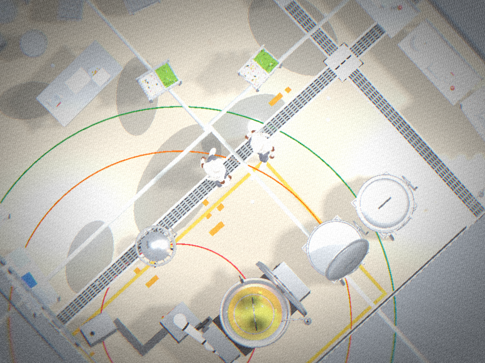
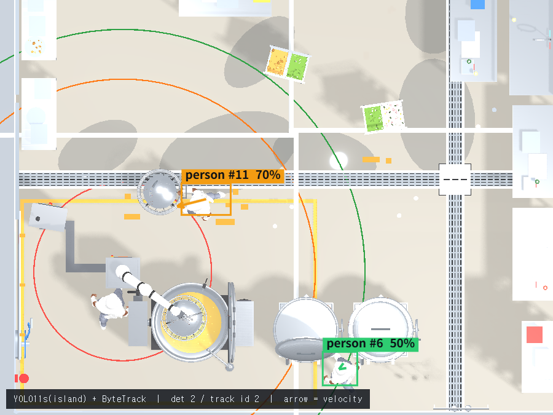
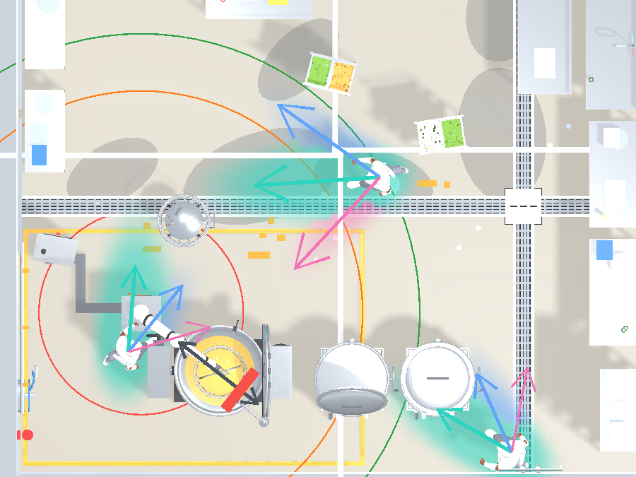
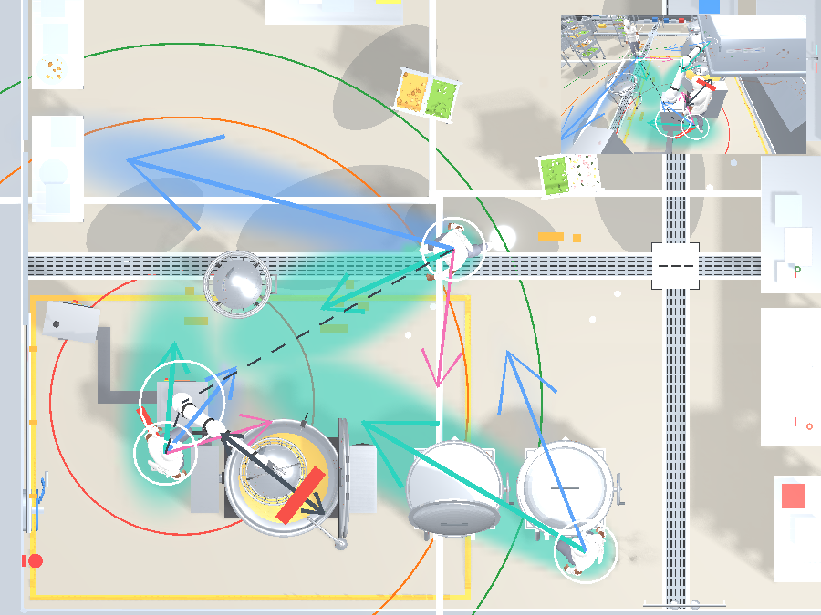

# Week 6 미팅 — 검출·예측 파이프라인 (발표·피드백용)

> **목적**: 이번에 한 작업을 설명하고, 아래 **열린 질문**에 피드백을 받는다.
> 상세 설정은 [yolo-training.md](yolo-training.md) · [lstm-training.md](lstm-training.md),
> 성능 요약은 [../model-scorecard.md](../model-scorecard.md).

## 한 문장 요약

천장 카메라 한 대로 **사람을 찾고 → 추적하고 → 앞으로 갈 곳을 예측해 → 로봇이 미리 피하는** 사슬을
시뮬레이터 위에서 끝까지 구현하고, 두 개의 인공지능(검출·예측)을 학습·평가했다.

```
CCTV → [검출 YOLO] → [추적 ByteTrack] → 좌표 → [예측 LSTM] → 안전판정 → 로봇 회피
```

---

## 1. 검출 — 사람을 "지금" 찾기

시뮬 합성 그림 **200장**으로 YOLO를 학습(실사는 학습에 0장). 사람 검출이 기성품 대비 크게 올랐다.

| person | 기성품 | 우리(시뮬 학습) |
|---|---|---|
| Recall | 0.175 | **0.871** (×5.0) |
| Precision | 0.374 | **0.872** |

 

_왼쪽: 학습에 쓴 시뮬 합성 그림(직교 나디르 카메라). 오른쪽: 검출기가 보는 화면 —
`person #11 70%`처럼 박스·확신도·트랙 번호가 붙는다._

---

## 2. 추적 — 같은 사람에 번호표

ByteTrack으로 사람마다 번호를 유지. 3명이 왕복해도 **26프레임 내내 번호 안 바뀜**(ID 스위치 0).
확신 낮은 검출(50%)도 버리지 않고 기존 번호에 이어 붙인다 — 안전에선 "잘 안 보여서 무시"가 위험.

---

## 3. 예측 — 앞으로 갈 곳 맞히기 (3갈래)

사람의 최근 발자국을 보고 4.8초 뒤까지 **3갈래**로 예측하는 LSTM. 옛 단순법보다 정확하고 위험을 일찍 잡음.

| | 옛 방법(칼만) | 우리 LSTM |
|---|---|---|
| 위치오차(ADE) | 1.031 m | **0.748 m** (−27%) |
| 안전 recall | 0.248 | **0.433** (전 갈래 0.756) |



_사람마다 여러 갈래의 미래를 색 구름(불확실)과 화살표(방향)로. 로봇은 또렷한 화살표로 자기 선택지를 표시._

---

## 4. 안전 제어 + 라이브 검증

로봇에 **선제 회피**를 새로 넣음: 곧 사람이 올 것 같으면 통로를 아예 안 건너거나(hold), 건너던 중이면
되돌아옴(retract). 종전엔 감속·정지뿐이었다. 전체 사슬을 실제로 켜서 동작 확인.



_라이브 전체 사슬: 사람 위치·안전반경(색 원)·예측 음영·로봇 회피 화살표가 한 화면에. 우상단은 3D 뷰._

---

## 핵심 결과 한 표

| 단계 | 지표 | before | after |
|---|---|---|---|
| 검출 | person recall | 0.175 (기성품) | **0.871** (시뮬 학습) |
| 예측 | 위치오차 ADE | 1.031 (칼만) | **0.748** (LSTM) |
| 예측 | 안전 recall | 0.248 (칼만) | **0.433** (LSTM) |

## 내가 내린 주요 결정 (왜)

- **천장 직교(나디르) 뷰 고정** — 원근 왜곡이 없어 사람 크기가 균일하고, 화면 좌표→바닥 좌표 변환이 쉬움.
- **test를 일부러 실사로 둠** — 시뮬로만 시험하면 점수가 부풀려진다(iid 착시). 그래서 실사로 냉정하게 쟀다.
- **궤적에 직무 구조를 넣음** — 완전 무작위 동선은 학습할 게 없어, 조리원 직무별 이동 패턴을 만들어
  넣었다. 실측으로 확인: 방문 분포 엔트로피 4.39비트(균등)→**1.85~2.79비트**, 평균 이동 5.47m→**2~3m**.
- **예측을 3갈래(멀티모달)로** — 사람의 미래는 하나가 아니다. 갈림길을 다 후보로 두고 안전판정.

---

## 🔴 열린 질문 — 피드백 받고 싶은 것

### 검출
1. **시뮬만으로 학습한 검출기는 실사에서 recall 0.048.** 실배포하려면 실사 주방 라벨이 필요한데,
   확보가 병목이다. **실사 데이터 수집을 어느 정도 우선할까?** (RF-DETR·지식 증류로 우회하는 길도 있음)
2. **라이선스** — YOLO는 AGPL(상용 시 소스공개 의무). 상용 배포라면 Apache-2.0인 RF-DETR로
   갈아탈지, 하이브리드로 갈지 결정이 필요하다.

### 예측
3. **LSTM에 "목표 스테이션" 힌트를 줄까?** 지금은 안 준다(좌표만). 그런데도 목표를 아는 규칙에
   근접(0.748 vs 0.694). 힌트를 주면 더 정확해지지만, 실배포에선 목표를 모르는 게 현실적이다.
4. **안전 운영점** — 최빈 갈래만 보면 recall 0.43(헛정지 적음), 3갈래 다 경계하면 0.76(헛정지 많음).
   **놓침(충돌 위험) vs 헛정지(가동률 저하), 어디를 기준선으로?**
5. **궤적이 시뮬 합성이다.** 실제 조리원 동선과 얼마나 닮았는지 검증이 필요하다 —
   현실성이 낮으면 예측 성능이 실환경에서 안 나온다.

### 안전 라벨
6. **로봇 정지반경이 3.1m로 커져, 5개 직무의 최근접이 전부 그 안에 든다.** 그래서 데이터셋
   안전 라벨(far/caution/danger)이 **다 danger**로 쏠려 "하드 네거티브"(안전한 예시)가 사라진다.
   임계값을 방 크기에 맞출지, 직무 구역을 로봇에서 뗄지 결정이 필요하다.

### 공통
7. **sim-to-real 갭이 최대 리스크다.** 이번엔 시뮬 안에서 사슬을 다 세웠으니,
   다음 분기의 초점을 "실사 데이터 확보"로 둘지 팀 판단이 필요하다.

---

## 다음 단계 (제안)

- 실사 주방 라벨 소량 확보 → sim-to-real 재측정 (합성 데이터 기여폭 확인)
- 예측기 시뮬 라이브 연동(`__customPredictor`)으로 실시간 회피까지 확인
- 안전 운영점 τ 튜닝 곡선 (recall/헛정지 트레이드오프)

_2026-08 · robot-kitchen-safety-sim · 발표: chanwoo_
