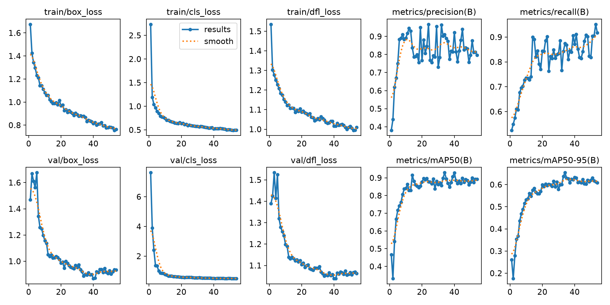
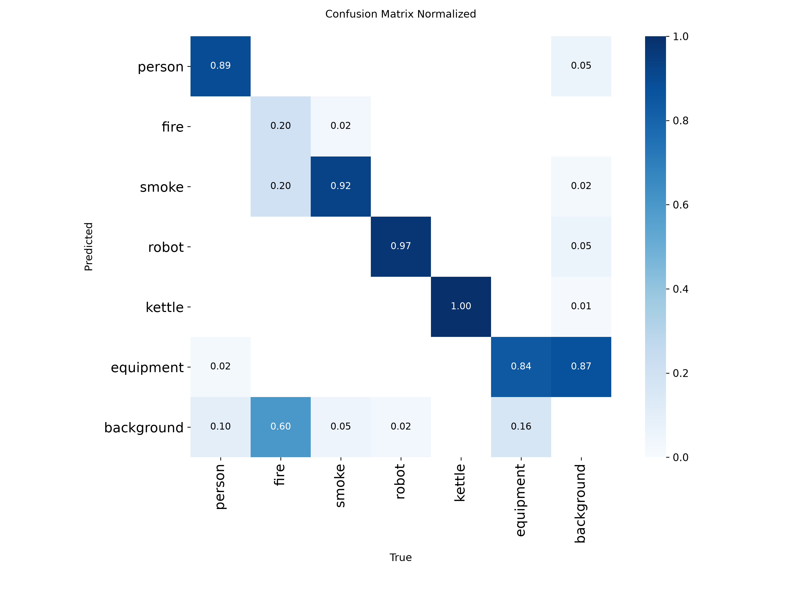
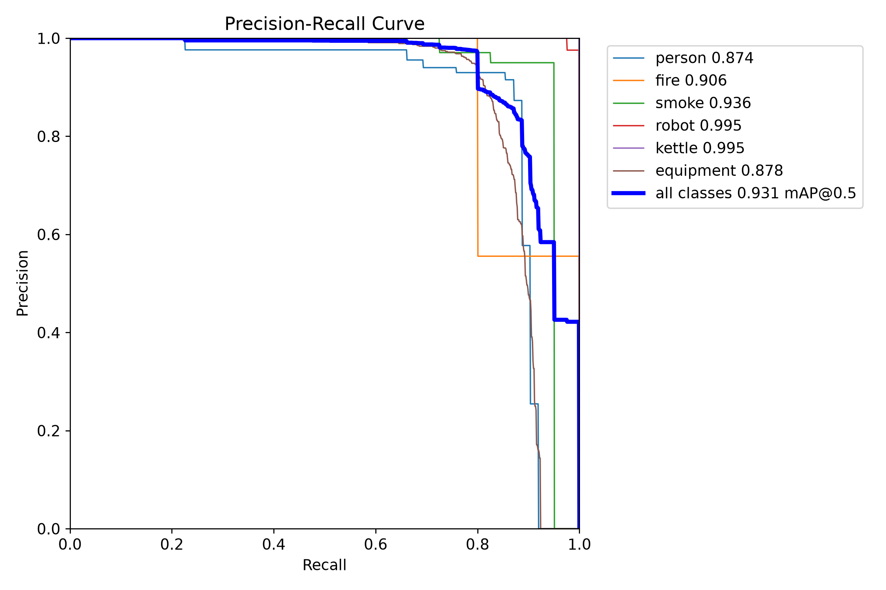

# YOLO 검출 모델 — 학습 설정

> 사슬에서 **검출**(사람을 지금 찾기) 담당. 사람 등 6클래스를 나디르 천장뷰에서 검출한다.
> 성능 결과는 [../model-scorecard.md](../model-scorecard.md), 상세 평가는 [../detection-eval.md](../detection-eval.md).

## 데이터 — 몇 장 썼나

> **시뮬 200장 · 실사 137장.**
> 시뮬 200장(학습 160 + 검증 40)으로 **학습**하고, 실사 137장으로 **시험**만 했다.
> 즉 실사는 학습에 0장 — 배포 모델은 오직 시뮬로만 배웠다.

| 용도 | 출처 | 장수 |
|---|---|---|
| **학습(train)** | 시뮬 합성 | **160** |
| **검증(val)** | 시뮬 합성 | **40** |
| 시뮬 소계 | | **200** |
| **시험(test)** | 실사 CCTV (Roboflow `overhead-person-szky0` v3) | **137** |

- **최종 배포 모델(island `best.pt`)은 시뮬 합성 200장만으로 학습**했다(train 160 / val 40).
  실사는 학습에 **0장** 들어갔고, 오직 시험(test)에만 썼다.
- 시뮬 200장 = 직교 나디르 카메라(CAM11)로 렌더한 합성 그림. 6클래스 라벨 포함.
- 실사 test 137장은 person(class 0)만 라벨돼 있어, 시뮬 모델을 재학습 없이 바로 평가할 수 있다.

### 참고 — 실사를 학습에 넣어본 실험(3-way)

"실사가 부족할 때 합성이 도움이 되나"를 본 별도 실험. 위 배포 모델과는 다른 모델들이다.

| 조건 | 실사 학습량 | 합성 학습량 |
|---|---|---|
| sim-only | 0 | 200 |
| real-only | 500 | 0 |
| real + sim | 500 | 200 |
| real-full (참고 레포) | ~3,406 | 0 |

- 세 조건 모두 **같은 실사 test 137장**에서 평가. 파일명 교집합 0 확인(누수 없음).
- 실사 가용분은 총 4,120장이지만, 부족 상황을 모사하려 **500장으로 제한**해 썼다.

### 데이터가 어떻게 생겼나


_학습에 쓴 시뮬 합성 그림. 직교 나디르 카메라라 원근 왜곡이 없고 사람 크기가 프레임 전역에서 균일하다._

## 분할 방식

- 시뮬 200장을 **8:2 셔플 분할**(시드 42). 파일을 옮기지 않고 `train.txt`/`val.txt` 목록으로만 나눈다.
- 같은 장면의 다른 카메라 뷰가 train/val에 갈리지 않게 **짝 단위로 분할**(데이터 누수 방지).
- 시뮬 자체의 held-out test는 없다 → 시뮬 성능(val 기준)은 약간 낙관적일 수 있으나,
  최종 판단 지표인 **실사 test는 완전 독립**이라 결론은 오염되지 않는다.

## epoch

- **설정 100, patience 20** — 20 epoch 동안 개선 없으면 자동 중단(조기종료).
- **실제 54 epoch에서 멈췄고, 최고점은 34 epoch**. 최종 `best.pt`는 100을 다 돈 게 아니라
  가장 좋았던 34 epoch의 가중치다.
- train box_loss: 1.674(1ep) → 0.763(54ep)로 하강. 34ep에서 mAP50 0.929 · mAP50-95 0.654.

## loss (Ultralytics 기본, 세 항의 가중합)

```
loss = box·7.5  +  cls·0.5  +  dfl·1.5
```
- **box**: 박스 위치가 얼마나 맞나. **cls**: 클래스(사람/솥 등)를 맞혔나.
- **dfl**(distribution focal): 박스 경계를 분포로 정밀하게 맞추는 항.

## 그 외 하이퍼파라미터

| 항목 | 값 |
|---|---|
| 베이스 | `yolo11s.pt` (COCO 사전학습) |
| imgsz | 640 |
| batch | -1 (자동) |
| optimizer | auto |
| lr0 / lrf | 0.01 / 0.01 |
| momentum | 0.937 |
| weight_decay | 0.0005 |
| warmup | 3 epoch |
| cos_lr | false |
| seed | 42 |
| 클래스(6) | `person · fire · smoke · robot · kettle · equipment` |

## 학습 결과 (그림)

 

_왼쪽: 학습 곡선(loss·mAP). 오른쪽: 혼동행렬 — 설비를 사람으로 오탐하지 않는 게 핵심(precision의 근거)._

 

_왼쪽: Precision-Recall 곡선. 오른쪽: 검출+추적 라이브 — `person #11 70%`처럼 박스·확신도·트랙 번호._

출처: `training/island_yolo11s/args.yaml` · `results.csv` · 분할 `train/prepare_yolo_split.py`

_측정 2026-08 · robot-kitchen-safety-sim_
