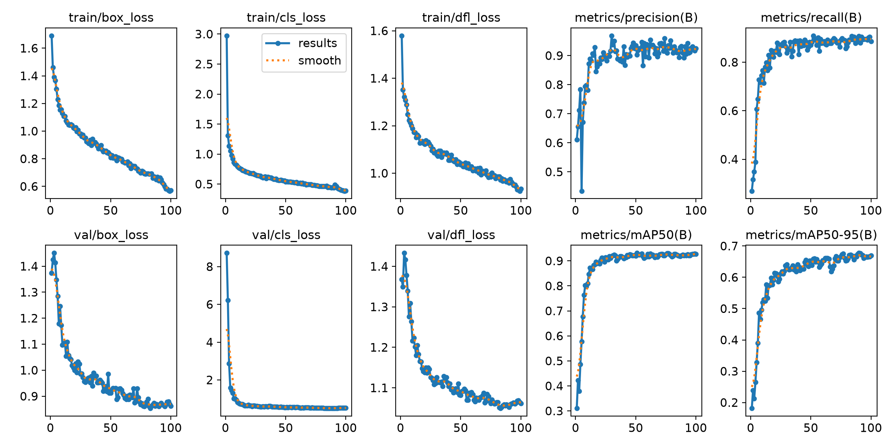
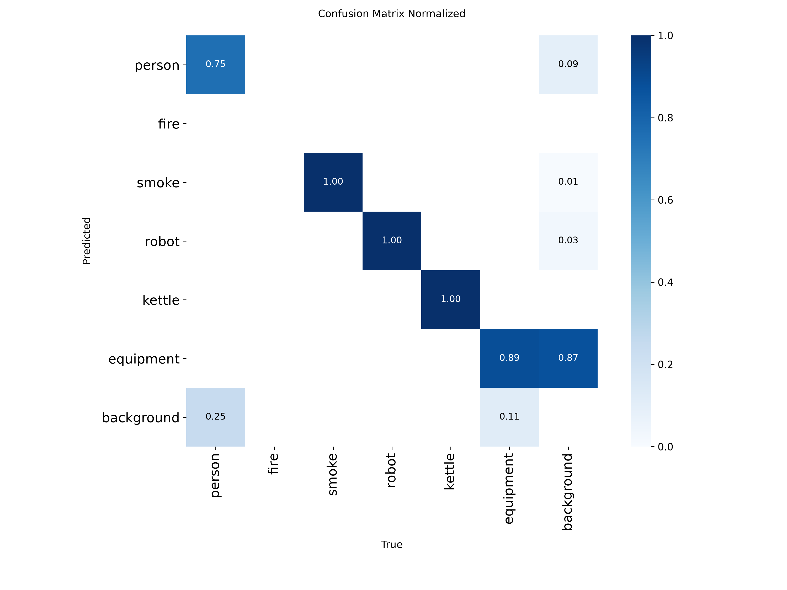
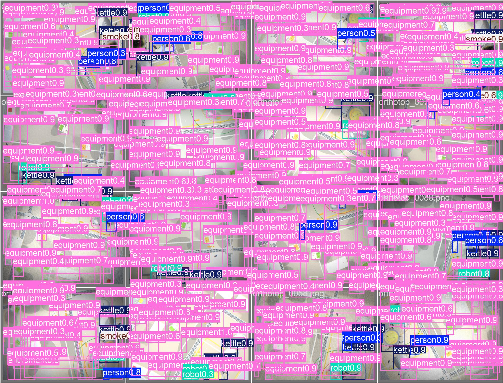
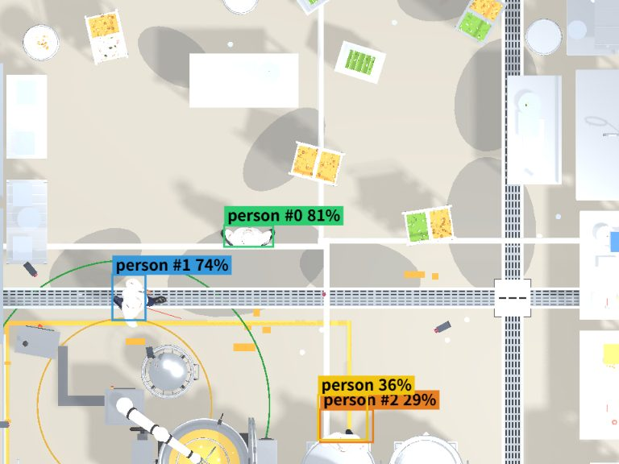

# train — top-down 사람 검출 학습 · 평가

시뮬 합성 데이터(직교 나디르 `orthotop`)로 **YOLO11 사람 검출기**를 파인튜닝하고,
합성(in-domain)·실사(sim-to-real)로 평가하는 파이프라인.
전체 사슬: `CCTV → 검출(YOLO) → 추적(ByteTrack) → (x,z) → 예측 → SSM` 중 **검출** 단계.

> 상세 평가 리포트: [`../docs/chanwoo/detection-eval.md`](../docs/chanwoo/detection-eval.md)
> 검출 서버(라이브 연동): [`../backend/detect_server.py`](../backend/detect_server.py)

## 환경 (uv)

```bash
uv sync                 # 학습: ultralytics + torch cu128 (RTX 5070 sm_120)
uv sync --group serve   # 검출 서버까지 (fastapi·uvicorn·supervision·trackers)
```

## 스크립트

| 파일 | 역할 |
|---|---|
| `prepare_yolo_split.py` | 시뮬 데이터셋(images/labels) → train/val 분할 + `data.yaml` (6클래스) |
| `train_sim.py` | YOLO11s 파인튜닝 + val 평가 + ONNX export → `training/yolo11s_orthotop/` |
| `eval_stock.py` | 파인튜닝 전 stock 모델 기준선(person) |
| `eval_real.py` | 학습 모델을 실사 데이터셋에서 평가 (sim-to-real) |
| `prep_3way.py` | sim/real/real+sim 3-way 비교용 데이터 구성 (limited-real) |

클래스: `0 person · 1 fire · 2 smoke · 3 robot · 4 kettle · 5 equipment`

## 실행

```bash
# 1) 시뮬에서 데이터 생성 후(브라우저 orthotop) 분할
uv run python train/prepare_yolo_split.py sim-person --val-ratio 0.2
# 2) 파인튜닝 (make-or-break)
uv run python train/train_sim.py
# 3) stock 기준선
uv run python train/eval_stock.py
# 4) 실사 평가 (Roboflow overhead-person v3 test)
uv run python train/eval_real.py dataset/overhead-person-v3/data.yaml --split test
```

---

## 결과 ① — Sim in-domain (합성 val 40장)

**파인튜닝 전/후 (person):**

| | Precision | Recall | mAP50 | mAP50-95 |
|---|---|---|---|---|
| stock yolo11s (COCO) | 0.374 | 0.175 | 0.212 | 0.094 |
| **파인튜닝 후** | **0.797** | **0.688** | **0.747** | 0.373 |

**클래스별 (파인튜닝 후):** 전체 mAP50 **0.922** · P 0.893 · R 0.906

| person | smoke | robot | kettle | equipment |
|---|---|---|---|---|
| R 0.688 | R 1.00 | R 0.973 | R 1.00 | R 0.868 |

→ **make-or-break PASS.** equipment(825개)를 "설비로" 잡아 person 오탐 억제(person precision 0.797).

<table>
<tr>
<td><br><sub>학습 곡선 (loss·mAP)</sub></td>
<td><br><sub>혼동행렬 (정규화)</sub></td>
</tr>
<tr>
<td><br><sub>val 예측 배치</sub></td>
<td><br><sub>라이브 검출+ByteTrack (detect_server)</sub></td>
</tr>
</table>

## 결과 ② — Sim-to-real 3-way (실사 test 137장, person)

실사가 부족한 현실(주방)을 모사해 **실사 500장으로 제한**하고 합성 기여를 측정.

| 조건 | 실사 학습량 | Recall | Precision | mAP50 |
|---|---|---|---|---|
| sim-only | 0 (sim 200) | 0.270 | 0.072 | 0.048 |
| real-only | 500 | 0.829 | 0.848 | 0.879 |
| **real + sim** | 500 (+sim 200) | **0.844** | **0.860** | **0.898** |
| real-full (참고 레포) | ~3,406 | 0.980 | 0.969 | 0.991 |

→ 합성만으론 실사 전이 실패(도메인 갭). **제한된 실사 체제에서 real+sim이 real-only를 전 지표에서 상회** → 합성이 양(+)의 기여. (상승폭이 작은 건 실사 test가 비주방이라서 — 실사 주방 test면 기여 커질 것으로 예상.)

## 산출물

`training/yolo11s_orthotop/weights/best.pt`(+`best.onnx`), 지표 `training/summary.json` · `training/real_eval.json`.
데이터셋·가중치·`training/`은 gitignore(용량).
